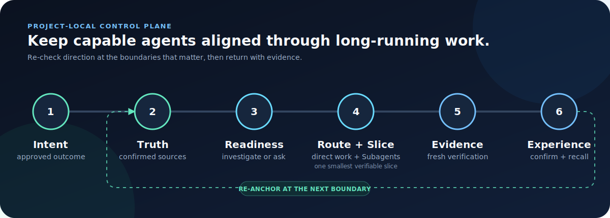
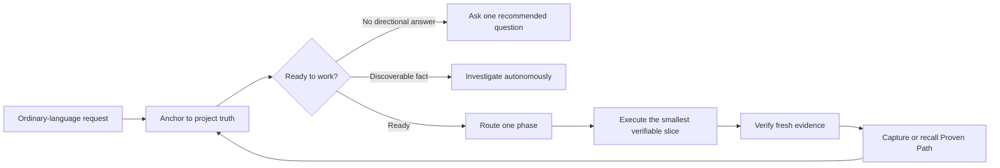

# VibeTether

> Even strong agents can drift during long-running work.

VibeTether is a beginner-friendly control Skill for long-running Codex and Claude
projects. It is designed for increasingly capable models—including GPT‑5.6 Sol,
Claude Fable 5, and the models that come next—helping coding agents stay aligned
during long, multi-stage work. At the moments that matter, it helps a cooperating
Agent re-check the goal, reread project rules, assess whether the work is ready, select
a suitable installed Skill, keep both direct work and work delegated to Subagents
within the smallest verifiable slice, and recall workflows that have already
succeeded.

You do not need to memorize Skill names or manage a rigid workflow. VibeTether
turns recurring lessons from experienced developers into a project-local
guidance layer, so capable Agents stay autonomous without quietly drifting into
expensive rework.

[](https://github.com/t01089572455/vibetether/actions/workflows/ci.yml)
[](LICENSE)
[](#honest-limits)



## One-command setup

Copy and paste this inside the project you want to control. Use it for a
**first install** or a **compatible upgrade**. It follows the current `main`:

```sh
npx --yes --package=https://codeload.github.com/t01089572455/vibetether/tar.gz/refs/heads/main?v=0.6.1 vibetether init --project . --agent both --profile extended --bundle web --bundle production --yes
```

That is the **full reviewed setup**: VibeTether for Codex and Claude Code,
plus its curated product, planning, debugging, testing, UI, Web, and production
specialists. The reliable Codeload form avoids npm's Git/SSH package path.
It does not install a global `vibetether` executable. Initialization creates the
project-local launcher used by the shorter commands below.

Re-run the command shown in the current README to upgrade a compatible project.
The `?v=0.6.1` suffix refreshes npm's cache key while the archive still follows
`main`; it is not a version pin. VibeTether preserves project-owned truth and
routing files and refuses unsafe Skill overwrites.

Using Codex only? Use the same reviewed setup with `--agent codex`:

```sh
npx --yes --package=https://codeload.github.com/t01089572455/vibetether/tar.gz/refs/heads/main?v=0.6.1 vibetether init --project . --agent codex --profile extended --bundle web --bundle production --yes
```

Prefer prompts over flags? Run the guided setup:

```sh
npx --yes --package=https://codeload.github.com/t01089572455/vibetether/tar.gz/refs/heads/main?v=0.6.1 vibetether init --project .
```

It explains each finite choice, recommends a safe default, and asks you to supply
the project goal and success evidence instead of letting the agent invent them.
See the [installation guide](docs/installation.md) for pinned releases, recovery,
smaller profiles, previews, and uninstall.

## Why I built this

I did not build VibeTether because modern coding agents are weak. I built it
because even highly capable agents can lose alignment during long-running,
multi-stage work. As context grows and phases change, they can lose sight of
the original request, project rules, approved decisions, the right Skill for
the moment, or workflows that have already succeeded.

I kept seeing the same failures: a specification existed but stopped governing
the work after compaction; an agent started from guesses because the brief was
vague; a useful Skill existed but a beginner did not know its name; a visual
direction was silently improvised; and a deployment or publishing path finally
worked but was forgotten on the next run.

VibeTether turns those lessons into a small project-local control layer. It is
designed for stronger agents such as Claude Fable 5 and GPT-5.6 Sol to reduce
long-task drift and expensive rework—not to replace their technical judgment.

Under the hood, VibeTether provides a project-local control plane for intent,
truth, routing, checkpoints, evidence, and proven workflows.

## See it in 30 seconds

You say: “Build me a customer portal.” You do not need to know any Skill name.

1. **Clarify intent.** Intent is vague, so VibeTether routes discovery to
   `grilling` and asks one recommended product question at a time.
2. **Choose direction.** Once the goal and acceptance evidence are ready, the
   agent re-enters the router at the phase change and uses `brainstorming` for
   alternatives and trade-offs.
3. **Plan one slice.** After direction is approved, `writing-plans` maps the
   larger goal, but only the current Smallest Verifiable Slice enters execution.
4. **Keep delegation bounded.** The host Agent still owns Subagent orchestration,
   whether it is Codex or Claude. VibeTether does not limit Subagent use; it keeps
   all direct or delegated work inside the same approved slice.
5. **Verify before advancing.** `test-driven-development` owns behavior changes,
   and `verification-before-completion` requires fresh slice evidence before
   the Agent advances or proposes another slice. The route is closed with a
   recorded `route complete` event, explicit Truth reconciliation, and a
   boundary-specific doctor check.

The installed project instructions tell a cooperating host Agent to perform the
same re-check at task entry, consequential phase changes, compaction, resume,
handoff, repeated failure, the next slice, completion, merge, release, and
publication. That **phase re-entry** helps keep a long Goal-mode task from treating
an old summary as current authority. It is behavioral guidance, not a host hook.
Initialization installs a versioned project-local launcher at
`.vibetether/bin/vibetether.mjs`; the managed instructions ask a cooperating
Agent to use it at consequential boundaries. VibeTether still does not install a
global `vibetether` executable.

## Features

**One project-local control loop—from an unclear request to verified, reusable experience.**

|  | Capability | What it gives you |
| :---: | --- | --- |
| 🧭 | **Readiness gate** | Helps a cooperating Agent avoid starting product work from guessed direction |
| 🗺️ | **User-owned truth map** | Keeps confirmed, candidate, and declined documents visible without silently activating them |
| ⚓ | **Project-truth re-anchor** | Guides a cooperating Agent to re-read applicable confirmed rules before consequential actions |
| 🧩 | **Automatic, inspectable Skill routing** | Maps observable task signals to one curated installed recommendation or declared fallback; selection remains advisory |
| 🤝 | **Stateful phase handshake** | The project-local CLI records a unique route instance, selection, required output, evidence, completion, or abandonment |
| 🧾 | **Truth reconciliation gate** | Requires each exited route to state whether confirmed authority stayed unchanged, has a pending candidate, was applied, or was declined |
| 🌳 | **Execution anchoring** | Records the real project-contained execution root and Git worktree/HEAD/content fingerprints when available |
| 🩺 | **Boundary-aware doctor** | Treats pending reconciliation, execution drift, launcher drift, and version mismatch more strictly at completion, handoff, merge, deployment, release, or publication |
| 📍 | **Long-task checkpoints** | Carries the current objective and slice through compaction, resume, and handoff |
| 🎯 | **Smallest Verifiable Slice** | Defines the smallest verifiable outcome that advances the approved goal and keeps direct or delegated work inside it—without limiting Subagent use |
| 🔁 | **Proven Path recall** | Reads a matching successful runbook before rediscovering an operational workflow |
| ✨ | **First-success capture** | Proposes a reusable workflow the first verified time it works; active indexing still needs confirmation |
| 📦 | **Curated providers** | Pins exact commits, fingerprints content, and keeps competing routers out of host discovery |
| 🪟 | **Safe Windows upgrades** | Preserves a verified replacement and attempts recovery after the host releases the lock |
| 🛠️ | **Project-local extension** | Lets each project add its own primary, alternative, or overlay routes |

## A project control plane, not another prompt

VibeTether gives a new or existing project a beginner-readable control surface:

| Artifact | Purpose |
| --- | --- |
| `AGENTS.md` and/or `CLAUDE.md` | Tells Codex or Claude Code when to re-enter VibeTether |
| `.vibetether/intent.md` | Records the user-owned goal, evidence, boundaries, and constraints |
| `.vibetether/TRUTH.md` | Lists confirmed truth, candidates awaiting confirmation, and declined candidates |
| `.vibetether/project.yaml` | Routes the control artifacts without copying their content |
| `.vibetether/capabilities.yaml` | Shows scenarios, routes, fallbacks, outputs, and exit evidence |
| `.vibetether/state/current.yaml` | Keeps the current phase and bounded slice resumable |
| `.vibetether/state/route-handshake.yaml` | Records the current route instance, execution root, disposition, and bounded evidence |
| `.vibetether/experience-index.yaml` | Points to reusable workflows that have actually succeeded |
| `.vibetether/bin/vibetether.mjs` | Pins one project-local CLI entry to the matching versioned VibeTether release tag |

Initialization creates a blank truth entry list. It may inspect repository
evidence for setup recommendations, but it does not automatically activate
project documents as confirmed truth, even when a file is named `PRD.md` or lives
under `docs/adr/`. Existing projects can migrate previously active VibeTether
sources, but newly discovered documents stay candidates until the user confirms
them.

The CLI maintains deterministic structure and validation. The Agent performs
semantic discovery, selective reading, routing, and checkpoint updates. The user
owns direction, active truth, visual choices, high-risk boundaries, and whether a
new Proven Path becomes reusable. This division gives VibeTether coordination
without turning a capable Agent into a rigid workflow robot.

## Manage VibeTether your way

You can ask the Agent to propose changes in ordinary language, or edit the
user-owned files directly. Active truth changes still require your explicit
confirmation.

| Artifact | How to manage it |
| --- | --- |
| `.vibetether/TRUTH.md` | Edit directly or ask the Agent to propose candidates and confirm them one at a time |
| `.vibetether/intent.md` | Use the project-local `bootstrap` command below or ask the Agent to propose a directional update |
| `.vibetether/routes.local.yaml` | Use the project-local `customize` command below or edit validated YAML directly |
| Proven Path documents | Edit the referenced sanitized runbook; confirm before active indexing |
| `.vibetether/project.yaml` | CLI-maintained topology; inspect it and normally repair it with the portable `init` command |
| `.vibetether/capabilities.yaml` | Generated board; inspect it with the project-local `capabilities` command |
| `.vibetether/state/current.yaml` | Runtime checkpoint; inspect it for diagnosis and normally let VibeTether maintain it |

Common guided operations:

```sh
node .vibetether/bin/vibetether.mjs bootstrap --project .
node .vibetether/bin/vibetether.mjs customize --project .
node .vibetether/bin/vibetether.mjs doctor --project . --boundary ordinary --json
```

Edit project prose outside VibeTether's markers in `AGENTS.md` or `CLAUDE.md`.
Rerun the portable `init` command to repair the CLI-maintained block. Do not hand-edit the
generated capability board, canonical Intent metadata, or runtime route state.

## Add project truth

`.vibetether/TRUTH.md` is the entry list for documents that may govern the
project. A new installation starts with an empty list. You can manage it without
learning its format—just talk to the Agent.

### Ask the Agent to configure it

Copy this into Codex or Claude:

```text
Search this repository for candidate truth and specification documents, including
instructions, product requirements, architecture, UI, testing, operations, and
release documents. Inspect their contents. For each candidate, explain its role,
scope, authority evidence, and conflicts. Add safe findings only under
`Candidates awaiting confirmation` in `.vibetether/TRUTH.md`. Do not activate or
use any source until I confirm its exact path, role, scope, and any supersession.
Show me the candidate diff and ask me to confirm candidates one at a time.
```

The Agent may update the candidate list, but candidates remain non-authoritative
and cannot govern implementation yet.

After reviewing the explanation, confirm the document you trust:

```text
I confirm `docs/product/approved-prd.md` as `product-direction` truth for scope
`.`. Move it from `Candidates awaiting confirmation` to
`Confirmed project truth`, show me the diff, explain when the Agent will reread
it, and run:
`node .vibetether/bin/vibetether.mjs doctor --project . --boundary ordinary --json`
```

### Configure it manually

Edit `.vibetether/TRUTH.md` directly. First add the proposal to the candidate
section:

```markdown
## Candidates awaiting confirmation

- [ ] `docs/product/approved-prd.md`
  - role: `product-direction`
  - scope: `.`
```

After you review the file and decide it should govern the project, move it to the
confirmed section and check it:

```markdown
## Confirmed project truth

- [x] `docs/product/approved-prd.md`
  - role: `product-direction`
  - scope: `.`
```

That manual move is your confirmation. Validate the result with:

```sh
node .vibetether/bin/vibetether.mjs doctor --project . --boundary ordinary --json
```

Documents created during a planning conversation follow the same candidate-first
flow. A move, delete, or supersede action on confirmed truth—and any role or
scope change—requires user confirmation. If confirmed truth conflicts with a
previously successful workflow, the Agent must show the conflict and ask instead
of letting old experience override current direction.

See [Project truth and document lifecycle](docs/project-truth.md).

## Add your own Skills

VibeTether can route a Skill you installed yourself, including one it does not
recommend or distribute. Adding the folder alone is not enough: the Skill must
also be connected to an observable project route before VibeTether can recommend
it for the right situation.

### Ask the Agent to install and connect it

Copy this into Codex or Claude and replace the placeholders:

```text
Install the reviewed Skill from `<URL-or-local-path>` for `<codex|claude|both>`.
I authorize this project-local Skill installation and the smallest safe
VibeTether route update.

1. Inspect its `SKILL.md`, source, license, intended use, and existing project
   Skills and routes. Stop and explain the problem if the source is untrusted,
   incompatible, ambiguously named, or conflicts with an existing route.
2. Install the complete Skill directory under
   `.agents/skills/<skill-name>/` and/or `.claude/skills/<skill-name>/` for the
   enabled host. Do not overwrite a different or modified Skill.
3. Add or update `.vibetether/routes.local.yaml` with the smallest
   signal-specific route that fits an existing phase and capability. Choose
   `primary`, `alternative`, or `overlay` deliberately, and do not weaken any
   authority, readiness, evidence, security, data, permission, or release gate.
4. Show the installed paths and route diff. Then verify the new route with:
   `node .vibetether/bin/vibetether.mjs capabilities --project . --phase <PHASE> --capability <CAPABILITY> --signal <SIGNAL> --agent <codex|claude> --json`
   and run:
   `node .vibetether/bin/vibetether.mjs doctor --project . --boundary ordinary --json`.
5. Report whether the signal-matched query actually recommends the new Skill.
   Do not claim it is routed merely because its directory exists.
```

This prompt authorizes the bounded project-local installation and route update.
The Agent should still stop for an untrusted source, destructive replacement,
route conflict, or other high-risk decision.

Want to approve the route before it is written instead? Use:

> Inspect my installed project Skills. For each relevant candidate, explain its
> source and role. Propose the smallest useful VibeTether route with phase,
> capability, observable signals, role, expected output, and exit evidence. Show
> the `routes.local.yaml` diff and wait for my confirmation before writing it.

### Configure it manually

Install or copy one reviewed `SKILL.md` directory under
`.agents/skills/<skill-name>/` and/or `.claude/skills/<skill-name>/`, then run:

```sh
node .vibetether/bin/vibetether.mjs customize --project .
```

The guided editor lists installed project Skills and asks for one existing
phase/capability, route role, observable signals, outputs, and exit evidence.
Confirm the preview to write `.vibetether/routes.local.yaml`, then inspect the
result with `capabilities` or a signal-matched route query. A local route can be
a signal-specific `primary`, an `alternative`, or an additive `overlay`.

Project-local routes are re-read live. They extend the reviewed board but cannot
weaken authority, readiness, evidence, security, permission, destructive-data,
or release gates. If a local primary is missing, VibeTether names the problem
and falls back to the curated route. The [routing guide](docs/routing.md) has the
complete YAML schema and verification sequence.

## The control loop



The router is advisory, not a rigid workflow engine. It can choose an installed
alternative when that better fits, but it records why. Low-risk, reversible,
goal-aligned technical work can proceed autonomously. Product direction,
architecture, visual direction, destructive data, permissions, and release scope
still require the appropriate user decision.

## Automatic routes are inspectable

See the capability board:

```sh
node .vibetether/bin/vibetether.mjs capabilities --project .
```

Start and close one phase route explicitly:

```sh
node .vibetether/bin/vibetether.mjs route --project . --execution-root . --phase PLAN --capability planning --signal multi-step-change --agent codex
node .vibetether/bin/vibetether.mjs route complete --project . \
  --evidence "The approved plan names bounded slices and verification." \
  --truth-decision no-material-change \
  --truth-reason "Planning evidence changed; confirmed project authority did not."
```

If the selected method no longer fits but confirmed authority is unchanged:

```sh
node .vibetether/bin/vibetether.mjs route abandon --project . \
  --reason "The selected provider cannot produce the required evidence." \
  --truth-decision no-material-change \
  --truth-reason "Changing the method did not change confirmed project authority."
```

If confirmed authority may have changed, close the route without the inline
Truth decision, update `TRUTH.md` only through the user-confirmed lifecycle, then
record the result:

```sh
node .vibetether/bin/vibetether.mjs truth reconcile --project . \
  --decision candidate-pending \
  --candidate docs/proposed-direction.md \
  --reason "The proposed direction is waiting for user confirmation."
```

The installed `AGENTS.md`/`CLAUDE.md` block tells the host agent to re-anchor at
long-task boundaries. The project-local commands above create the stateful route
record expected by those instructions. A record proves that a route was selected and disposed;
it does not expose private reasoning or pretend to prove semantic correctness.
Read the [routing guide](docs/routing.md) for the complete model.

### What the project-local CLI record writes

Automatic phase re-entry is behavioral guidance in `AGENTS.md` or `CLAUDE.md`,
not a background daemon or host hook. Only an executed project-local `route` command writes
`.vibetether/state/route-handshake.yaml` and synchronizes
`.vibetether/state/current.yaml`. Each start receives a unique route instance and
records the actual execution directory plus Git worktree, HEAD, and content
fingerprints when Git is available. `route complete` records bounded evidence and
safe project-relative artifacts; `route abandon` records a material reason. Each
exit also requires an explicit Truth disposition before the next route or a
completion-like boundary. Without those commands, there is no stateful CLI
record. The file is the latest route disposition, not automatic background
history or proof that the work is semantically correct.

The route phase must match the current semantic checkpoint phase in
`.vibetether/state/current.yaml`. When work is genuinely entering a new phase,
the cooperating Agent re-anchors and updates that checkpoint first, then starts
the matching `route` handshake. This stops a `PLAN` command from quietly being
recorded while the resumable project state still says `DISCOVER`.

Before completion, handoff, merge, deployment, release, or publication, pass the
actual boundary:

```sh
node .vibetether/bin/vibetether.mjs doctor --project . --boundary completion
```

Ordinary work may report some transition states as attention; completion-like
boundaries fail closed on pending Truth reconciliation, execution drift, or a
project-local CLI version mismatch.

For the full reviewed setup, `motion-design` becomes a **design overlay** for
motion signals such as `animation` or `micro-interaction`; `gsap-core` becomes
an **implementation overlay** for `motion`, `gsap`, or scroll-animation signals.
The other installed GSAP Skills stay visible as focused aliases. Ordinary React
or frontend work alone does not automatically select a GSAP overlay.

## Preserve proven workflows

After every verified engineering- or user-level success, the installed
instructions require the host Agent to run the Success Capture Gate and classify
the result as `captured`, `already-encoded`, or `not-reusable`. A reusable
workflow that works for the first time is a `first-proven-path` even when it never
failed first. The Agent proposes a sanitized candidate; it becomes active
experience only after user confirmation.

Later, `applicable_experience` returns only matching metadata and safe artifact
paths. The agent reads the selected runbook before improvising the same build,
environment, deployment, publishing, migration, authentication, or recovery
path again. Credentials, private keys, one-time codes, private reasoning, and
sensitive tool output are never captured. See [Proven Paths](docs/proven-paths.md).
Confirmed truth always outranks procedural experience. A mismatch returns to the
user for a durable decision and update.

## Profiles and providers

- `core`: the provider-free control loop and built-in fallbacks.
- `standard`: complete pinned Matt Pocock, Superpowers, and Karpathy catalogs,
  with only compatible specialists exposed.
- `extended`: `standard` plus Anthropic's `frontend-design` and LottieFiles'
  `motion-design` overlay.
- `--bundle web`: signal-matched Vercel Web specialists plus GreenSock's eight
  official `gsap-*` Skills; only explicit motion signals route `gsap-core`.
- `--bundle production`: approved CI/CD, migration, security, observability,
  performance, and release specialists.

No provider is downloaded during active work. VibeTether does not search GitHub
by star count or install arbitrary repositories; sources are reviewed, pinned,
fingerprinted, and license-checked during explicit initialization. Complete
inventories and exposure rules live in [Providers and Skills](docs/providers.md).

## Codex and Claude Code

| Host | Project instruction | Entry Skill | Specialist exposure |
| --- | --- | --- | --- |
| Codex | `AGENTS.md` | `.agents/skills/vibe-tether/` | `.agents/skills/` |
| Claude Code | `CLAUDE.md` | `.claude/skills/vibe-tether/` | `.claude/skills/` |

Both are VibeTether preview targets. Other Agent Skills hosts can use the portable
Skill, but project instruction discovery and phase re-entry are host-dependent.

## Verify the installation

```sh
node .vibetether/bin/vibetether.mjs doctor --project . --boundary ordinary --json
node .vibetether/bin/vibetether.mjs capabilities --project .
```

For repository contributors, the offline acceptance tour is:

```sh
npm ci
npm run acceptance:tour
```

## Honest limits

VibeTether is a behavioral control layer, not a security sandbox or a guaranteed
workflow engine. Its automatic behavior requires the host agent to cooperate
with project instructions. It cannot guarantee zero drift, correct user choices,
perfect Skill quality, or successful external services.

Mentions of model names describe intended use, not compatibility or compliance
guarantees.

Reducing drift and expensive rework is the design goal. VibeTether makes no
measured Token-savings claim. Its deterministic tests verify routing contracts,
phase handshakes, recovery, capture rules, and static drift-pressure scenarios;
they are not proof that every model will obey every instruction.

## Documentation

- [Installation and updates](docs/installation.md)
- [Project truth and document lifecycle](docs/project-truth.md)
- [Routing, phase re-entry, and project extensions](docs/routing.md)
- [Proven Path capture and recall](docs/proven-paths.md)
- [Providers, catalogs, exposure, and licenses](docs/providers.md)
- [Troubleshooting](docs/troubleshooting.md)
- [Windows Skill lifecycle recovery](docs/operations/windows-skill-lifecycle.md)
- [Third-party notices](THIRD_PARTY_NOTICES.md)
- [Contributing](CONTRIBUTING.md)

## Community basis

VibeTether is an original control kernel informed by recurring practices in
[Superpowers](https://github.com/obra/superpowers),
[Matt Pocock's Skills](https://github.com/mattpocock/skills),
[GitHub Spec Kit](https://github.com/github/spec-kit),
[OpenSpec](https://github.com/Fission-AI/OpenSpec),
[BMAD Method](https://github.com/bmad-code-org/BMAD-METHOD),
[Anthropic Skills](https://github.com/anthropics/skills), Vercel's agent Skills,
Addy Osmani's engineering Skills, and Karpathy-style coding guidance.
Popularity helped discovery; tests, compatibility, license evidence, and role
boundaries decide what VibeTether exposes.

Node.js 20 or newer is required. VibeTether is released under the [MIT License](LICENSE).
