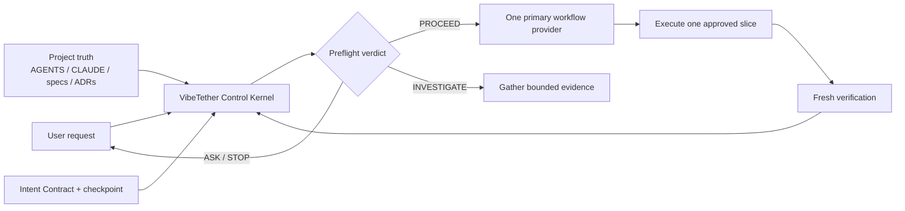
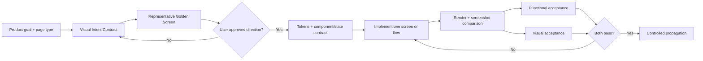

# VibeTether

> Keep coding agents tethered to project truth.

[](https://github.com/t01089572455/vibetether/actions/workflows/ci.yml)
[](LICENSE)
[](#preview-status)

VibeTether is a cross-agent control Skill for long-running coding work. It reduces the risk of capable agents drifting away from approved goals after context compaction, phase changes, repeated corrections, handoffs, or large project growth.

It does not replace an agent's coding ability or impose one giant development method. It keeps a small control kernel stable, re-anchors decisions to existing project truth, gates directional choices, and routes each phase to one focused workflow provider.

## Quick start

Install only the portable Agent Skill:

```sh
npx skills add t01089572455/vibetether --skill vibe-tether
```

Or bootstrap the full project control layer for Codex and Claude Code:

```sh
npx --yes github:t01089572455/vibetether init --agent both --profile standard --yes
```

Preview the changes first by replacing `--yes` with `--dry-run`.

The bootstrap creates or updates only bounded VibeTether surfaces:

```text
.agents/skills/vibe-tether/       Codex project Skill
.claude/skills/vibe-tether/       Claude Code project Skill
.vibetether/project.yaml          index of existing project truth
.vibetether/intent.md             durable Intent Contract
AGENTS.md                          managed instruction block only
CLAUDE.md                          managed instruction block only
.gitignore                         local checkpoint exclusion only
```

Existing instructions are preserved and backed up before their first change. Repeated initialization is byte-for-byte idempotent. Malformed managed blocks, symlink escapes, and modified Skill copies stop with an explicit conflict instead of being overwritten.

## Why it exists

Strong coding agents usually fail long projects less from inability to write code than from control decay:

- an approved requirement is compressed into a lossy summary;
- a lower-authority plan silently replaces product direction;
- a local technical choice becomes an unapproved architecture decision;
- a UI pattern spreads across many screens before one direction is approved;
- passing unit tests are promoted into product or visual acceptance;
- several good workflow Skills compete for ownership of the same phase.

VibeTether turns those failure modes into explicit preflight classes, ownership rules, gates, evidence contracts, and recovery paths.

## Control architecture



The lifecycle is:

```text
DISCOVER -> ALIGN -> DESIGN -> PLAN -> EXECUTE_ONE -> VERIFY -> REVIEW
                                                           |-> SHIP
                                                           |-> NEXT
                                                           |-> STOP
```

Before consequential actions, the Skill performs a lightweight preflight. It performs a full re-anchor after compaction, resume, handoff, phase changes, conflicts, repeated failure, structural decisions, UI propagation, and release operations.

Direction uncertainty always goes back to the user with a recommendation. Low-risk, reversible, goal-aligned technical choices remain autonomous. Structural technical choices require investigation, a recommended option, trade-offs, and confirmation.

## UI control loop

UI is treated as product direction, not decorative cleanup.



One representative golden screen must be approved before a visual pattern is propagated. Functional and visual acceptance are separate verdicts. Existing product capabilities may not be hidden merely to make an interface look cleaner.

## Commands

Show all options:

```sh
npx --yes github:t01089572455/vibetether --help
```

Audit an initialized project:

```sh
npx --yes github:t01089572455/vibetether doctor --project . --json
```

Preview a managed-only uninstall:

```sh
npx --yes github:t01089572455/vibetether uninstall --project . --dry-run
```

Apply the uninstall after reviewing the plan:

```sh
npx --yes github:t01089572455/vibetether uninstall --project . --yes
```

`vibetether uninstall --dry-run` removes no files. Applied uninstall removes only VibeTether-managed instruction blocks and unchanged installed Skill copies. It preserves the manifest, Intent Contract, runtime state, user documents, and backups.

Exit codes are stable: `2` for invalid CLI input, `3` for project conflicts, and `4` for failed health checks.

## Profiles and providers

| Profile | Intended policy envelope |
| --- | --- |
| `core` | Intent, authority, preflight, re-anchor, checkpoint, conflicts, and drift reporting |
| `standard` | Core plus common implementation, browser verification, and review contracts |
| `extended` | Standard plus additional UI, security, and release capability candidates |

In the `0.1.0` preview, profiles are recorded policy intent; the bundled safe kernel remains the fallback. Remote community providers are discovery candidates only. They are disabled by default and may not be downloaded during an active task. A future resolver may activate one only after source, immutable version, license, integrity, compatibility, and evaluation are verified.

The registry includes capability contracts for requirements clarification, design, planning, implementation, TDD, debugging, frontend product design, frontend engineering, browser verification, security review, code review, and release verification.

## Agent support

| Agent harness | Status | Enforcement |
| --- | --- | --- |
| Codex | Official preview | Project Skill plus a bounded `AGENTS.md` block |
| Claude Code | Official preview | Project Skill plus a bounded `CLAUDE.md` block |
| Other Agent Skills hosts | Portable Skill; not release-tested | Host-dependent automatic routing |

Project instructions are a behavioral control layer, not a security sandbox. VibeTether does not add privileged hooks, MCP servers, telemetry, deployment access, or remote execution by default.

## Community basis

VibeTether is an original control kernel built from recurring practice across projects such as [Superpowers](https://github.com/obra/superpowers), [GitHub Spec Kit](https://github.com/github/spec-kit), [OpenSpec](https://github.com/Fission-AI/OpenSpec), [BMAD Method](https://github.com/bmad-code-org/BMAD-METHOD), and [Anthropic's Skills](https://github.com/anthropics/skills), plus practitioner experience with persistent specifications, small slices, screenshot comparison, design tokens, explicit references, evidence, and structured handoffs.

No upstream workflow is silently bundled or made authoritative. Popularity is a discovery signal, not proof that a provider fits a project.

## Preview status

This is a **0.1.0 preview**. The repository includes deterministic contract tests and five static drift-pressure scenarios. Those checks are not independent agent forward tests: they do not measure model behavior across genuinely long contexts, and they cannot justify a `1.0.0` claim.

A three-role comparative adjudication in the development session also scored synthetic next-action responses. The VibeTether-enabled run scored **30/30**, versus **24/30** for an already strong baseline, while using **35.0%** more words. The observed gain was in explicit re-anchor, checkpoint, authority, and dual-acceptance discipline; both runs remained directionally safe. This is useful preview evidence, but it is still a single synthetic response trial rather than a real multi-hour project execution. Read the [full evaluation, raw limitations, and post-test findings](evals/results/preview-evaluation.md) and [run metadata](evals/results/run-metadata.json).

VibeTether aims to reduce the risk and propagation cost of drift. It cannot guarantee host-level automatic invocation, perfect source quality, or correct user decisions. See [the evaluation boundary](evals/README.md) for what is and is not measured.

## Development

Requires Node.js 20 or newer.

```sh
npm ci
npm run check
npm pack --dry-run
```

Read [CONTRIBUTING.md](CONTRIBUTING.md) before changing control semantics, adapters, or provider metadata. Report security issues using [SECURITY.md](SECURITY.md).

## License

[MIT](LICENSE)
