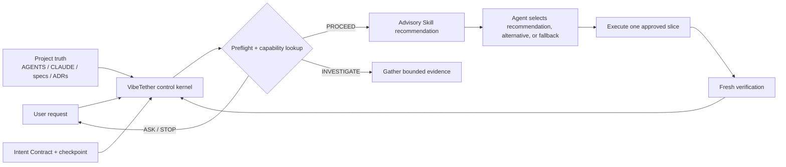
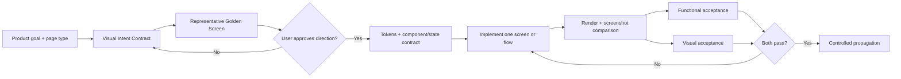

# VibeTether

> Keep coding agents tethered to project truth.

[](https://github.com/t01089572455/vibetether/actions/workflows/ci.yml)
[](LICENSE)
[](#preview-status)

VibeTether is a cross-agent control Skill and advisory capability router for vague requests and long-running coding work. It reduces the risk of capable agents drifting away from approved goals after context compaction, phase changes, repeated corrections, handoffs, or large project growth.

It does not replace an agent's coding ability or impose one giant development method. It re-anchors decisions to existing project truth, gates high-risk choices, and gives the agent a project-local board for deciding whether and which specialist Skill to use. Ordinary Skill recommendations are advisory, not mandatory.

## Quick start

Install only the portable Agent Skill, without community providers or project instructions:

```sh
npx skills add t01089572455/vibetether --skill vibe-tether
```

Or bootstrap the full project control layer for Codex and Claude Code. The default `standard` profile installs 17 complete upstream Skills from exact commits in one command:

```sh
npx --yes github:t01089572455/vibetether init --agent both --profile standard --yes
```

Preview the changes first by replacing `--yes` with `--dry-run`. Use `--profile core` for an offline VibeTether-only installation. Use `--profile extended` to add Anthropic's complete `frontend-design` Skill to the standard bundle.

The bootstrap creates or updates only bounded project surfaces:

```text
.agents/skills/vibe-tether/       Codex project Skill
.claude/skills/vibe-tether/       Claude Code project Skill
.agents/skills/<provider>/         Complete curated provider Skills for Codex
.claude/skills/<provider>/         Complete curated provider Skills for Claude Code
.vibetether/project.yaml          Index of existing project truth
.vibetether/intent.md             Durable Intent Contract
.vibetether/capabilities.yaml     Advisory capability and Skill routing board
.vibetether/providers.lock.yaml   Exact sources, fingerprints, ownership, and versions
.vibetether/licenses/             Installed upstream license copies
AGENTS.md                          Managed instruction block only
CLAUDE.md                          Managed instruction block only
.gitignore                         Local checkpoint exclusion only
```

Existing instructions are preserved and backed up before their first change. Repeated initialization is byte-for-byte idempotent. Malformed managed blocks, symlink escapes, changed provider licenses, and modified Skill copies stop with an explicit conflict instead of being overwritten.

Running `init` also upgrades an unmodified canonical VibeTether 0.1.0 project Skill to 0.2.0 atomically. Only the exact published 0.1.0 fingerprint is eligible: customized or otherwise changed copies still stop for review, and a failed later installation restores the previous Skill.

## Why it exists

Strong coding agents usually fail long projects less from inability to write code than from control decay:

- an approved requirement is compressed into a lossy summary;
- a lower-authority plan silently replaces product direction;
- a local technical choice becomes an unapproved architecture decision;
- a UI pattern spreads across many screens before one direction is approved;
- passing unit tests are promoted into product or visual acceptance;
- several good workflow Skills compete for ownership of the same phase.

VibeTether turns those failure modes into explicit preflight classes, ownership rules, advisory routes, gates, evidence contracts, and recovery paths.

## Control architecture



The lifecycle is:

```text
DISCOVER -> ALIGN -> DESIGN -> PLAN -> EXECUTE_ONE -> VERIFY -> REVIEW
                                                           |-> SHIP
                                                           |-> NEXT
                                                           |-> STOP
```

Before consequential actions, the Skill performs a lightweight preflight. It performs a full re-anchor after compaction, resume, handoff, phase changes, conflicts, repeated failure, structural decisions, UI propagation, and release operations.

Direction uncertainty goes back to the user with a recommendation. Low-risk, reversible, goal-aligned technical choices remain autonomous. Architecture, public contracts, visual direction, destructive data operations, permissions, security, privacy, and merge/deploy/release/publication remain explicit confirmation boundaries.

A missing optional provider causes a fallback recommendation, not a failed task. The checkpoint records the recommended path, selected path, material reason, and invocation status without storing private reasoning.

## UI control loop

UI is treated as product direction, not decorative cleanup.



One representative golden screen must be approved before a visual pattern is propagated. Functional and visual acceptance are separate verdicts. Existing product capabilities may not be hidden merely to make an interface look cleaner.

## Commands

Show all options:

```sh
npx --yes github:t01089572455/vibetether --help
```

Show the full project capability dashboard:

```sh
npx --yes github:t01089572455/vibetether capabilities --project .
```

Ask for a deterministic, machine-readable route:

```sh
npx --yes github:t01089572455/vibetether capabilities --project . --phase DISCOVER --capability requirements-clarification --signal goal-unclear --agent codex --json
```

The installed Skill includes an offline resolver:

```sh
node .agents/skills/vibe-tether/scripts/resolve-route.mjs --project . --phase PLAN --capability planning --signal multi-step-change --agent codex
```

Audit an initialized project:

```sh
npx --yes github:t01089572455/vibetether doctor --project . --json
```

Preview and apply a managed-only uninstall:

```sh
npx --yes github:t01089572455/vibetether uninstall --dry-run
npx --yes github:t01089572455/vibetether uninstall --project . --dry-run
npx --yes github:t01089572455/vibetether uninstall --project . --yes
```

Applied uninstall removes only VibeTether-managed instruction blocks, generated routing files, unchanged provider licenses, and unchanged installed Skill copies. It preserves the manifest, Intent Contract, runtime state, user documents, backups, and every provider that existed before VibeTether.

Exit codes are stable: `2` for invalid CLI input, `3` for project conflicts, and `4` for failed health checks.

## Profiles and providers

| Profile | Installed policy envelope |
| --- | --- |
| `core` | Offline VibeTether kernel and full built-in capability board; no community providers |
| `standard` | Core plus 17 complete pinned Skills for clarification, design, planning, execution, TDD, diagnosis, review, verification, and branch finish |
| `extended` | Standard plus Anthropic's complete pinned `frontend-design` Skill |

The `standard` bundle installs complete Skill directories from `mattpocock/skills` v1.1.0 and `obra/superpowers` v5.1.0. It includes the explicit `grill-me` alias and model-invokable `grilling` workflow, plus specialist Skills such as `brainstorming`, `writing-plans`, `test-driven-development`, `systematic-debugging`, `verification-before-completion`, and `requesting-code-review`. VibeTether intentionally excludes the competing `using-superpowers` top-level router so one entry router owns the capability board.

Provider installation occurs only during explicit `init`, never during an active coding task. Every source is pinned to an exact commit; VibeTether verifies the complete Skill directory fingerprint and upstream license before an atomic copy, records installation ownership, installs the exact license text, and supplies a built-in fallback for optional routes. See [third-party notices](THIRD_PARTY_NOTICES.md).

The generated board includes capability contracts for requirements clarification, document alignment, domain modeling, product and UI design, planning, plan execution, TDD, debugging, frontend engineering, browser verification, security review, code review, completion verification, and release/branch finish. It also lists every installed Skill, source, capability, live harness availability, invocation policy, matching routes, and use signals. Explicit-only aliases such as `grill-me` remain visible without being auto-selected.

## Agent support and guarantee boundary

| Agent harness | Status | Routing surface |
| --- | --- | --- |
| Codex | Official preview | Project Skill, `AGENTS.md` block, board, and offline resolver |
| Claude Code | Official preview | Project Skill, `CLAUDE.md` block, board, and offline resolver |
| Other Agent Skills hosts | Portable Skill; not release-tested | Host-dependent advisory routing |

VibeTether cannot guarantee that every model host will implicitly invoke a Skill before every step; that decision remains host-controlled. In initialized Codex and Claude projects, managed instructions and broad Skill metadata make the entry points explicit. Once VibeTether is active, the board and resolver make recommendation selection inspectable and deterministic, while the agent retains discretion over optional providers.

Project instructions are a behavioral control layer, not a security sandbox. VibeTether does not add privileged hooks, MCP servers, telemetry, deployment access, or remote execution by default.

## Community basis

VibeTether is an original control kernel built from recurring practice across projects such as [Superpowers](https://github.com/obra/superpowers), [Matt Pocock's Skills](https://github.com/mattpocock/skills), [GitHub Spec Kit](https://github.com/github/spec-kit), [OpenSpec](https://github.com/Fission-AI/OpenSpec), [BMAD Method](https://github.com/bmad-code-org/BMAD-METHOD), and [Anthropic's Skills](https://github.com/anthropics/skills), plus practitioner experience with persistent specifications, small slices, screenshot comparison, design tokens, explicit references, evidence, and structured handoffs.

Curated upstream Skills are not embedded in the VibeTether package; the explicit `standard` or `extended` initializer fetches and verifies their exact commits before project-local installation. No upstream workflow becomes project authority. Popularity is a discovery signal, not proof that a provider fits a project.

## Preview status

This is a **0.2.0 preview**. The repository includes deterministic contract and lifecycle tests plus six static drift-pressure and advisory-routing scenarios. Those checks are not independent agent forward tests: they do not measure model behavior across genuinely long contexts, and they cannot justify a `1.0.0` claim.

A three-role comparative adjudication in the development session also scored synthetic next-action responses. The VibeTether-enabled run scored **30/30**, versus **24/30** for an already strong baseline, while using **35.0%** more words. The observed gain was in explicit re-anchor, checkpoint, authority, and dual-acceptance discipline; both runs remained directionally safe. This is useful preview evidence, but it is still a single synthetic response trial rather than a real multi-hour project execution. Read the [full evaluation, raw limitations, and post-test findings](evals/results/preview-evaluation.md) and [run metadata](evals/results/run-metadata.json).

VibeTether aims to reduce the risk and propagation cost of drift. It cannot guarantee host-level automatic invocation, perfect source quality, or correct user decisions. See [the evaluation boundary](evals/README.md) for what is and is not measured.

## Development

Requires Node.js 20 or newer.

```sh
npm ci
npm run check
npm pack --dry-run
```

Read [CONTRIBUTING.md](CONTRIBUTING.md) before changing control semantics, adapters, or provider metadata. Report security issues using [SECURITY.md](SECURITY.md).

## License

[MIT](LICENSE)
