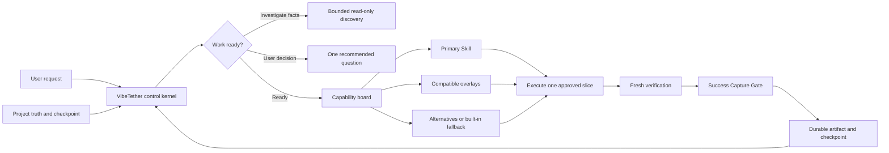
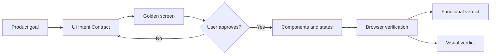

# VibeTether

> Keep coding agents tethered to project truth.

[](https://github.com/t01089572455/vibetether/actions/workflows/ci.yml)
[](LICENSE)
[](#preview-status)

VibeTether is a project-local control Skill, advisory Skill router, and reusable-success capture loop for long-running coding work. It helps capable agents keep the approved goal, project rules, current slice, required evidence, and proven operational paths visible after context compaction, handoffs, phase changes, and repeated corrections.

Users do not need to memorize community Skill names. VibeTether checks whether the task is ready, infers observable scenario signals, recommends one installed specialist plus compatible overlays and alternatives, and keeps a safe built-in fallback. Product direction and high-risk decisions still belong to the user; low-risk, reversible technical work remains autonomous.

## Quick start

If you want the simplest path, copy the first command below. The profile, bundle, portable-only, preview, and two-stage choices come afterward.

## Fastest setup: install everything

Run this from the project you want VibeTether to control:

```sh
npx --yes github:t01089572455/vibetether init --project . --agent both --profile extended --bundle web --bundle production --yes
```

This is VibeTether's maximum reviewed installation. It installs the control Skill for Codex and Claude Code, then downloads and catalogs every curated source enabled by VibeTether: the base Matt Pocock, Superpowers, and Karpathy catalogs; the Anthropic extension; the Vercel Web catalog; and the Addy Osmani Production catalog.

"Install everything" does not expose every upstream Skill to every agent. VibeTether catalogs the complete pinned inventories for provenance and routing, but exposes only the approved, compatible specialists. Competing routers, duplicate workflows, and unrelated Skills remain outside host discovery so the capability board can recommend a clear primary route.

Verify the installation:

```sh
npx --yes github:t01089572455/vibetether doctor --project . --json
npx --yes github:t01089572455/vibetether capabilities --project .
```

### Windows Schannel recovery

Most users do not need this. If a provider download fails with `schannel`, `SEC_E_NO_CREDENTIALS`, or `failed to receive handshake`, run the same installation in Command Prompt with Git's documented environment-config channel:

```bat
set "GIT_CONFIG_COUNT=1"
set "GIT_CONFIG_KEY_0=http.sslBackend"
set "GIT_CONFIG_VALUE_0=openssl"
npx --yes github:t01089572455/vibetether init --project . --agent both --profile extended --bundle web --bundle production --yes
```

`GIT_SSL_BACKEND=openssl` does not configure Git's HTTP backend and is ignored. The three `GIT_CONFIG_*` variables above are inherited by the provider Git subprocesses and are equivalent to configuring `http.sslBackend=openssl` for that command session.

## Customize the installation

Use the following options only when the recommended install-everything path is not what you want.

### Provider-free two-stage bootstrap

If provider networking is unavailable, install the control loop first and upgrade later:

```sh
npx --yes github:t01089572455/vibetether init --project . --agent both --profile core --no-auto-bundles --yes
npx --yes github:t01089572455/vibetether init --project . --agent both --profile extended --bundle web --bundle production --yes
```

The `core` step is provider-free: it installs VibeTether, managed project instructions, the built-in capability board, checkpoint state, and safe fallbacks without cloning a community repository. Re-running `init` with `extended` upgrades the same installation transactionally.

### Install only the portable Skill

Use this if you want VibeTether's control method without changing project instructions or fetching community providers:

```sh
npx skills add t01089572455/vibetether --skill vibe-tether
```

### Preview before writing

Run this from the project you want to control:

```sh
npx --yes github:t01089572455/vibetether init --agent both --profile standard --dry-run
```

The dry-run is network-free for provider content and writes nothing. Review the exact project files, provider catalogs, exposures, and license operations before applying them.

### Use the smaller standard profile

```sh
npx --yes github:t01089572455/vibetether init --agent both --profile standard --yes
```

The `standard` profile audits and catalogs 53 complete upstream Skills at exact commits, while only 21 exposed Skills enter Codex or Claude discovery. Competing routers and unrelated specialists stay outside host discovery.

### Verify and inspect

```sh
npx --yes github:t01089572455/vibetether doctor --project . --json
npx --yes github:t01089572455/vibetether capabilities --project .
```

Ask the router for a deterministic decision:

```sh
npx --yes github:t01089572455/vibetether capabilities --project . --phase DISCOVER --capability requirements-clarification --signal goal-unclear --agent codex --json
```

### Update or repair

Run the same `init` command again. Re-running `init` is the update and repair workflow: unchanged installations are byte-for-byte idempotent, new catalog plans are verified before writes, and modified managed copies stop for review.

### Preview or apply uninstall

```sh
npx --yes github:t01089572455/vibetether uninstall --dry-run
npx --yes github:t01089572455/vibetether uninstall --project . --yes
```

Uninstall removes only unchanged VibeTether-owned files and managed instruction blocks. It preserves the Intent Contract, user documents, runtime checkpoint, backups, and every Skill that existed before VibeTether.

## What gets installed?

VibeTether does not require community Skills. Its control loop, readiness gate, checkpoint rules, risk gates, capability contracts, and built-in fallbacks work with the `core` profile. Community Skills are optional specialist providers that a reviewed non-core installation can make available to the router.

VibeTether does not search GitHub by star count, install arbitrary repositories, follow floating upstream revisions, or fetch a new provider because a task happens to need one. Every curated source is declared in this repository, pinned to an exact commit, fingerprinted, and checked against recorded license evidence. Provider content is fetched only during an explicit non-core `init`; no provider is downloaded during active work.

| Command or profile | Third-party network activity | Project result |
| --- | --- | --- |
| `npx skills add ... --skill vibe-tether` | Fetches the VibeTether package only | Installs the portable entry Skill; it does not initialize project instructions or community providers |
| `init --profile core` | No provider fetch | Installs VibeTether, managed project instructions, a built-in capability board, checkpoint state, and provider-free fallbacks |
| `init --profile standard` | Fetches pinned Matt Pocock, Superpowers, and Karpathy sources | Base inventory: 53 complete upstream Skills cataloged and 21 exposed Skills; repository evidence may also select `web` or `production` bundles |
| `init --profile extended` | Standard sources plus pinned Anthropic source | Adds `frontend-design` without replacing the primary product-design workflow |
| `init --bundle web` | Fetches the pinned Vercel catalog | Catalogs all 9 Vercel Skills and exposes only signal-matched Web specialists |
| `init --bundle production` | Fetches the pinned Addy Osmani catalog | Catalogs all 24 Skills and exposes only approved production specialists; an explicit bundle exposes the approved seven |

`standard` and `extended` scan the repository before installation. React, Next.js, React Native, Expo, or `vercel.json` can select the `web` bundle; GitHub Actions or a recognized migration directory can select `production`. Use `--no-auto-bundles` when you want the base profile only, and always run `--dry-run` first to see the exact catalogs, exposures, files, and license operations. The dry-run does not fetch provider content or write project files.

The initial `npx` command may need network access to obtain VibeTether itself unless it is already cached. That package does not embed the community provider repositories; an explicit non-core `init` fetches the pinned sources directly and stages them before any project write.

## How agents discover installed Skills

A successful project initialization makes provider knowledge visible through four separate surfaces. This is what lets an agent know that a specialist exists without loading every downloaded Skill into every prompt.

| Surface | Audience | What it tells them |
| --- | --- | --- |
| `.agents/skills/` and `.claude/skills/` | Codex and Claude Code host discovery | Complete verified copies of exposed Skills, including each upstream `SKILL.md` trigger and instructions |
| `.vibetether/capabilities.yaml` | VibeTether and the coding agent | Scenarios, capability purpose, `When to use` signals, primary recommendation, overlays, alternatives, live installation paths, fallback, required outputs, and exit evidence |
| `.vibetether/providers.lock.yaml` | Installer, `doctor`, maintainers, and the agent when provenance matters | Exact repository, commit, fingerprint, license evidence, catalog/exposure status, installation path, activity, and ownership |
| `.vibetether/providers/catalog/` | Local inventory and deliberate lookup | Every complete audited upstream Skill; catalog-only entries stay outside host discovery to avoid trigger collisions and context noise |

The installer also writes a marked block to `AGENTS.md`, `CLAUDE.md`, or both. That block tells the host agent to enter through VibeTether, read the capability board, refresh live availability, use a fitting installed recommendation or justified alternative, and record the selected path. VibeTether's own `SKILL.md` repeats that contract at task entry, phase changes, resume, handoff, and compaction recovery.

Run the human-readable dashboard at any time:

```sh
npx --yes github:t01089572455/vibetether capabilities --project .
```

Its output includes an `Automatic work-readiness gate`, every capability with `When to use`, expected outputs and exit evidence, catalog-only alternatives, and an `Installed Skill inventory` with availability, capabilities, routes, and invocation policy. For a machine-readable live route, supply a phase, capability, signals, and harness:

```sh
npx --yes github:t01089572455/vibetether capabilities --project . --phase DIAGNOSE --capability debugging --signal bug-fix --agent codex --json
```

The resolver checks the recorded installation paths again before answering, so initialization-time state is not mistaken for live availability. If the preferred provider is missing, the result selects an installed alternative or the declared built-in fallback; it never downloads a replacement mid-task.

### Default `standard` provider map

The base `standard` profile exposes these 21 Skills to each enabled host. `Primary` owns a workflow phase, `domain` adds a non-overlapping specialty, `alternative` is selected only when its signals fit, `policy` is an overlay, and `explicit alias` preserves an upstream command while an automatic route covers the same behavior.

| Skill | Source | Role and normal route |
| --- | --- | --- |
| `grilling` | `mattpocock/skills` | Primary requirements and document-alignment interview when goal, scope, constraints, or success evidence are unclear |
| `grill-me` | `mattpocock/skills` | Explicit alias; automatic behavior is covered by `grilling` |
| `grill-with-docs` | `mattpocock/skills` | Explicit alias; automatic behavior is covered by `grilling` plus `domain-modeling` |
| `domain-modeling` | `mattpocock/skills` | Domain support for durable terminology, glossary, model, or ADR decisions |
| `codebase-design` | `mattpocock/skills` | Alternative read-only orientation when repository entry points are unclear |
| `prototype` | `mattpocock/skills` | Alternative throwaway experiment when testing is cheaper than debating uncertainty |
| `research` | `mattpocock/skills` | Alternative primary-source research when a current external fact is required |
| `brainstorming` | `obra/superpowers` | Primary product/design workflow after intent is ready for alternatives and trade-offs |
| `dispatching-parallel-agents` | `obra/superpowers` | Domain workflow only when tasks are independent, subagents exist, and delegation is authorized |
| `executing-plans` | `obra/superpowers` | Primary execution of one verified plan slice at a time |
| `finishing-a-development-branch` | `obra/superpowers` | Primary integration and release-choice workflow after implementation is verified |
| `receiving-code-review` | `obra/superpowers` | Domain check for incoming review feedback before accepting changes |
| `requesting-code-review` | `obra/superpowers` | Primary separated review against request, diff, and evidence |
| `subagent-driven-development` | `obra/superpowers` | Primary plan execution only when subagents are available and delegation is authorized |
| `systematic-debugging` | `obra/superpowers` | Primary diagnosis for unexpected behavior before proposing a fix |
| `test-driven-development` | `obra/superpowers` | Domain red-green-refactor workflow for new behavior and bug fixes |
| `using-git-worktrees` | `obra/superpowers` | Domain isolation when a feature needs a separate worktree |
| `verification-before-completion` | `obra/superpowers` | Primary fresh-evidence gate before completion claims |
| `writing-plans` | `obra/superpowers` | Primary implementation planning after direction is approved |
| `writing-skills` | `obra/superpowers` | Domain workflow for creating or revising an Agent Skill |
| `karpathy-guidelines` | `multica-ai/andrej-karpathy-skills` | Policy overlay for simple, surgical, assumption-aware implementation |

Downloading a complete catalog does not make every catalog entry automatically invokable. A catalog-only Skill is stored locally and may appear as a named alternative in the capability board, but it remains outside host discovery. This is intentional: exposing competing routers or every specialist at once would increase trigger collisions and context cost.

## How automatic routing works

VibeTether separates automatic readiness from advisory provider choice:

1. At task entry, phase transitions, consequential actions, resume, or compaction recovery, the agent rereads the project manifest and applicable truth.
2. It classifies missing information as discoverable fact, user-owned direction, structural decision, or local reversible technique.
3. It infers observable signals from the request, repository, lifecycle state, and current evidence.
4. The project board returns a `primary` recommendation, compatible `overlays`, ordered `alternatives`, a `fallback`, required outputs, and exit evidence.
5. The agent uses the recommendation when it fits, or records why another installed path is better. No provider is downloaded during active work.
6. High-risk gates remain mandatory regardless of which provider is selected.
7. After verified success, the agent captures a first, recovered, or changed reusable path, deduplicates unchanged repeats, records the disposition, and runs `doctor` before a completion-like transition.



Implementation waits for `READY_FOR_IMPLEMENT_ONE`. A clear, low-risk task can pass in one compact check. A vague request routes to clarification automatically; the user does not need to type `grill-me` or know that it exists.

The router is explainable, not coercive. A JSON resolution includes detected signals, rationale, live harness availability, primary, overlays, alternatives, fallback, required outputs, exit evidence, and any confirmation gate. VibeTether cannot guarantee that every host model invokes a Skill before every step; initialized project instructions and broad Skill metadata make the route visible, while host behavior remains host-controlled.

### How reusable success is captured

Initialized `AGENTS.md` and `CLAUDE.md` blocks tell the agent to apply VibeTether automatically at task entry and completion boundaries. After every verified user-level or engineering-level success, the agent checks whether it established a reusable workflow.

- `first-proven-path`: the workflow succeeded for the first verified time, even on the first attempt; create a durable record immediately.
- `recovered-path` or `changed-proven-path`: update the existing record with the verified condition or recovery path.
- `repeat-proven-path`: point to the unchanged existing record without creating a duplicate.
- `routine-non-path`: create no document.

The checkpoint disposition is deliberately small: `captured`, `already-encoded`, or `not-reusable`. Tests, runtime output, remote refs, browser acceptance, deployment checks, or CI prove success; the checkpoint only records how the experience was handled. `vibetether doctor` checks that a completion-like checkpoint is no longer pending and that required artifact paths exist. Semantic classification remains model judgment, so the preview does not claim perfect automatic recognition.

Durable knowledge goes to its natural source: tests or validators for deterministic behavior, runbooks for build/deployment/local-environment procedures, ADRs for architecture, product specifications for product decisions, and Skill references plus evals for cross-project agent methods. VibeTether does not create a universal success ledger and never records credentials, private keys, one-time codes, private reasoning, or sensitive tool output.

See the [GitHub publishing Proven Path](docs/operations/github-publishing.md) and [Windows Skill lifecycle recovery](docs/operations/windows-skill-lifecycle.md) for real operational examples.

## Profiles and bundles

| Profile | Catalog and exposure behavior | Network boundary |
| --- | --- | --- |
| `core` | VibeTether plus the full built-in capability board; no community catalog or provider exposure | No provider network access |
| `standard` | Complete Matt Pocock, Superpowers, and Karpathy catalogs; 21 exposed Skills | Fetches pinned sources during explicit `init` |
| `extended` | Standard plus Anthropic `frontend-design` | Fetches the additional pinned Anthropic source |

Optional bundles add complete catalogs and expose only applicable specialists:

| Bundle | Complete catalog | Automatically detected evidence | Exposed specialists |
| --- | --- | --- | --- |
| `web` | 9 Vercel Skills | React, Next.js, React Native, Expo, or `vercel.json` | Matching React, React Native, Web verification, Vercel, and performance specialists |
| `production` | 24 Addy Osmani Skills | GitHub Actions or a recognized migration directory | Matching CI/CD or migration specialists; explicit selection exposes the seven approved production specialists |

Force one or both bundles:

```sh
npx --yes github:t01089572455/vibetether init --profile standard --bundle web --yes
npx --yes github:t01089572455/vibetether init --profile standard --bundle production --yes
npx --yes github:t01089572455/vibetether init --profile standard --bundle web --bundle production --yes
```

Disable repository-evidence bundle selection:

```sh
npx --yes github:t01089572455/vibetether init --profile standard --no-auto-bundles --yes
```

`core` rejects `--bundle` so its provider path stays offline. An explicit bundle is an install-time decision, not permission to deploy, migrate data, change secrets, or publish. Those actions keep their separate user gates.

## When should I use what?

The agent-facing version of this table is contract-linked to [`registry/scenarios.json`](registry/scenarios.json) and installed with the Skill.

| Scenario ID | Plain-language situation | Recommended path |
| --- | --- | --- |
| `vague-project` | Goal, scope, or acceptance is unclear | `grilling`, then a user-owned Intent Contract |
| `document-conflict` | The request and durable project sources disagree | Document alignment and authority resolution; stop if unresolved |
| `unfamiliar-codebase` | Repository entry points are unclear | `codebase-design` before planning or editing |
| `huge-effort` | Work spans many workstreams or context windows | Built-in milestone/checkpoint wayfinding; catalog-only `wayfinder` remains visible |
| `prototype-choice` | A bounded experiment can answer costly uncertainty | `prototype` with a learning goal and discard boundary |
| `new-behavior` | One approved slice adds behavior | VibeTether execution primary plus `karpathy-guidelines` policy overlay |
| `bug-diagnosis` | Behavior is unexpected and cause is unknown | `systematic-debugging` before a fix |
| `ui-direction` | Visual direction is not approved | UI Intent Contract and golden screen; `frontend-design` in `extended` |
| `web-implementation` | Approved React, Next.js, React Native, or Vercel work | Highest-priority matching Web specialist |
| `compaction-handoff` | Context was compacted, resumed, or handed off | Full VibeTether re-anchor before action |
| `triage-qa` | Several issues need reproduction and priority | Built-in evidence-first triage; catalog alternatives remain visible |
| `architecture-improvement` | Structural friction suggests a durable change | Evidence-led recommendation, then user confirmation |
| `production-migration` | A migration or deprecation is proposed | `deprecation-and-migration` plus destructive-data gate |
| `first-proven-path` | A reusable workflow succeeds for the first verified time | Capture a sanitized durable Proven Path immediately |
| `completion` | The agent is about to claim completion | `verification-before-completion` with fresh evidence |

## Walkthroughs

### A vague new project

The user says, "Build me a customer portal." VibeTether detects `goal-unclear` and `scope-unclear`, investigates facts already present in the repository, and routes to model-invokable `grilling`. It asks only decisions the user owns, one at a time, with a recommendation. No product implementation starts until goal, boundaries, success evidence, and the first slice are explicit.

### An unfamiliar codebase

The task is clear, but the agent cannot name the relevant entry points. The `unfamiliar-codebase` route selects `codebase-design` for a read-only map. If external facts are also uncertain, `research` can run as a separate specialist. If a design question is cheaper to test than debate, `prototype-choice` selects a bounded throwaway experiment.

### A long or compacted task

After compaction or handoff, `compaction-handoff` does not trust the summary alone. It reloads the manifest, applicable project truth, checkpoint, repository state, current slice, and missing evidence. For `huge-effort`, the built-in milestone map keeps one current frontier and resumable checkpoints; upstream explicit wayfinding and handoff commands remain searchable catalog alternatives.

### UI direction and implementation

`ui-direction` first locks product goal, page type, information hierarchy, interaction states, brand constraints, and one representative golden screen. Visual direction requires user approval before propagation. Only then does `web-implementation` select a React, Next.js, React Native, or Web specialist. Browser behavior and visual similarity are verified separately.



### Bug diagnosis

`bug-diagnosis` routes to `systematic-debugging`: reproduce, isolate, form discriminating hypotheses, identify root cause, then implement the smallest correction with regression evidence. A test failure is evidence, not automatic permission for a broad rewrite.

### Release or migration

`production-migration` can recommend the Addy migration specialist, but it cannot approve destructive data work. Release preparation can recommend `shipping-and-launch`; publication still requires fresh verification and explicit user confirmation. Provider choice never weakens migration, permission, security, privacy, merge, deploy, release, or publish gates.

### First successful build, deployment, or publication

The first verified reusable workflow is not treated as a routine success. VibeTether classifies it as `first-proven-path`, creates a concise runbook or other durable artifact, records how success was verified, and indexes the artifact in the checkpoint. A later recovered or environment-specific success updates that artifact. An unchanged repeat points to the existing encoding instead of creating another document.

## Catalog vs exposure

VibeTether deliberately separates five concepts:

- **Cataloged**: the complete audited Skill directory is stored under `.vibetether/providers/catalog/` for local inventory and routing metadata. It is ignored by Git and outside host Skill discovery.
- **Exposed**: a verified copy is installed under `.agents/skills/` or `.claude/skills/`, where the selected host can discover it.
- **Automatically eligible**: the upstream Skill permits model invocation and VibeTether has a non-conflicting route for the current signals.
- **Alternative or overlay**: the Skill can support a primary workflow without taking phase ownership. Karpathy guidance is a policy overlay, not a workflow router.
- **Catalog-only or explicit-only**: the Skill remains searchable but is not silently invoked. VibeTether supplies an automatic built-in equivalent when appropriate.

Complete catalogs do not mean "run everything." Stacking several workflow owners increases trigger collisions and context cost. VibeTether therefore does not expose competing router Skills such as `using-superpowers`, `ask-matt`, or `using-agent-skills`. Their repositories are still fully cataloged.

Upstream command aliases are handled honestly. `grill-me` is an explicit alias, while its behavior is automatically covered by model-invokable `grilling`. `grill-with-docs` is covered by `grilling` plus `domain-modeling`. Upstream `wayfinder`, `handoff`, and `triage` remain catalog alternatives when their metadata does not permit implicit invocation; novice-facing automatic routes use VibeTether's safe equivalent instead of pretending the literal command ran.

## Codex and Claude

The same router supports both project harnesses:

| Harness | Instruction surface | Entry Skill | Provider exposure |
| --- | --- | --- | --- |
| Codex | `AGENTS.md` managed block | `.agents/skills/vibe-tether/` | `.agents/skills/` |
| Claude Code | `CLAUDE.md` managed block | `.claude/skills/vibe-tether/` | `.claude/skills/` |

Generated project surfaces:

```text
.vibetether/project.yaml          Project truth index, profile, bundles, and detected evidence
.vibetether/intent.md             Durable user-owned Intent Contract
.vibetether/capabilities.yaml     Scenarios, capabilities, routes, availability, and fallbacks
.vibetether/providers.lock.yaml   Exact sources, catalog/exposure state, fingerprints, and ownership
.vibetether/licenses/             Verified full license text when available
.vibetether/providers/catalog/    Complete local upstream catalogs; outside host discovery
.vibetether/state/current.yaml    Local resumable checkpoint; ignored by Git
```

VibeTether edits only its marked instruction blocks and creates a backup before the first instruction-file change. Existing project instructions remain authoritative. The managed block tells the agent to consult the board and reassess readiness before consequential work and after re-anchor boundaries.

The installed offline resolver needs no network:

```sh
node .agents/skills/vibe-tether/scripts/resolve-route.mjs --project . --phase PLAN --capability planning --signal multi-step-change --agent codex
node .claude/skills/vibe-tether/scripts/resolve-route.mjs --project . --phase VERIFY --capability completion-verification --signal about-to-claim-complete --agent claude
```

## Command reference

Show supported commands and flags:

```sh
npx --yes github:t01089572455/vibetether --help
```

Common operations:

```sh
# Offline provider-free project control
npx --yes github:t01089572455/vibetether init --agent codex --profile core --yes

# Standard setup with automatic repository-evidence bundles
npx --yes github:t01089572455/vibetether init --agent both --profile standard --yes

# Full dashboard or one JSON route
npx --yes github:t01089572455/vibetether capabilities --project .
npx --yes github:t01089572455/vibetether capabilities --project . --phase EXECUTE_ONE --capability frontend-engineering --signal react --agent codex --json

# Health check
npx --yes github:t01089572455/vibetether doctor --project . --json

# Safe removal preview and apply
npx --yes github:t01089572455/vibetether uninstall --project . --dry-run
npx --yes github:t01089572455/vibetether uninstall --project . --yes
```

Stable exit codes are `2` for invalid CLI input, `3` for a project conflict, and `4` for a failed health check.

## Upgrade and repair

Run `init` again with the desired profile, harnesses, and bundles. The installer:

1. scans repository evidence without changing files;
2. resolves the complete catalog and smaller exposure plan;
3. fetches exact commits only for non-core operations;
4. verifies every expected Skill directory, fingerprint, and license-evidence record in staging;
5. refuses undeclared upstream Skills or changed declared-license text;
6. applies catalog, exposures, lock, board, licenses, and managed instructions atomically;
7. preserves pre-existing identical Skills without claiming ownership.

Use `--dry-run` first when changing profiles or bundles. A profile downgrade keeps inactive ownership records so a later uninstall can still remove unchanged VibeTether-owned copies safely.

## Troubleshooting

### PowerShell blocks `npm.ps1`

Some Windows execution policies block the PowerShell wrapper even though Node.js and npm are installed. Use the command shim explicitly, for example `npm.cmd test`, `npm.cmd run check`, or `npm.cmd version`, instead of weakening the machine execution policy for VibeTether.

If npm reports `EPERM` while writing a cache under a protected installation directory such as `Program Files`, point `npm_config_cache` to a user-writable temporary or user cache directory for that command. Do not run the release as Administrator merely to make a shared npm cache writable.

### `doctor` reports a changed managed Skill

VibeTether will not overwrite or remove the modified copy. Back up the customization, compare it with the pinned upstream version, then either restore the managed fingerprint or move the customization to a user-owned Skill name before re-running `init`.

An exact fingerprint from a registered legacy VibeTether release is not a customization. Current releases can upgrade or uninstall those known copies while continuing to reject unknown content.

### Windows reports `EPERM` while uninstalling a Skill

Claude Code, Codex, an editor, or another process may still have a file open without Windows delete sharing. Close the process using the affected Skill and retry the same `uninstall --dry-run` before applying `uninstall --yes`. VibeTether quarantines Skill directories before editing managed instruction blocks, so a lock at this stage leaves those text files unchanged. See [Windows Skill lifecycle recovery](docs/operations/windows-skill-lifecycle.md).

### A provider is unavailable during a task

Run `capabilities` again so live installation paths are refreshed. Optional providers fall back to the declared built-in path. Do not download a new provider in the middle of active work; reconfigure it through a reviewed `init` operation.

### The expected Web or Production specialist was not exposed

Inspect `bundle_signals` in `.vibetether/project.yaml`. Use `--bundle web` or `--bundle production` for an explicit install-time choice. Use `--no-auto-bundles` when repository evidence should not control bundle selection.

### Initialization stops on license evidence

This is intentional. A missing full license, changed README declaration, unexpected Skill directory, wrong commit, or fingerprint mismatch stops before project writes. Review the pinned source and update registry evidence in a new audited release; do not bypass the check locally.

### Project instructions contain a managed-block conflict

VibeTether edits only exact marked blocks. Preserve the user text, repair duplicate or reversed markers manually, and re-run `init --dry-run`. It will not guess which conflicting block should win.

### I only want the control loop

Use `--profile core`. Provider fetching is disabled for that initialization path. The initial `npx` acquisition may still require the package source unless it is already cached.

## Provider provenance and licensing

All provider sources are pinned to exact commits. VibeTether verifies the declared complete inventory and per-Skill fingerprints before copying anything into a project.

| Source | Pinned release or commit | Catalog | License evidence mode |
| --- | --- | ---: | --- |
| `mattpocock/skills` | `v1.1.0` / `d574778f94cf620fcc8ce741584093bc650a61d3` | 38 complete Skills | MIT `full-text` |
| `obra/superpowers` | `v5.1.0` / `f2cbfbefebbfef77321e4c9abc9e949826bea9d7` | 14 complete Skills | MIT `full-text` |
| `multica-ai/andrej-karpathy-skills` | `2c606141936f1eeef17fa3043a72095b4765b9c2` | 1 complete Skill | MIT `readme-declaration` |
| `anthropics/skills` | `9d2f1ae187231d8199c64b5b762e1bdf2244733d` | selected `frontend-design` | Apache-2.0 `full-text` |
| `vercel-labs/agent-skills` | `f8a72b9603728bb92a217a879b7e62e43ad76c81` | 9 complete Skills | MIT `readme-declaration` |
| `addyosmani/agent-skills` | `98967c45a42b88d6b8fb3a88b7ff6273920763d6` | 24 complete Skills | MIT `full-text` |

`full-text` means the pinned source contains a full license file whose exact hash is verified and whose text can be installed under `.vibetether/licenses/`. `readme-declaration` means the upstream repository declares the license in a pinned README but does not provide the expected full license file at that commit. VibeTether verifies the README hash and exact declaration, records a visible warning and provenance in the lock, does not fabricate license text, and does not embed that provider content in the npm package.

Provider content is fetched only during an explicit non-core `init`. It remains governed by its upstream license and is not relicensed by VibeTether. See [THIRD_PARTY_NOTICES.md](THIRD_PARTY_NOTICES.md).

## Agent support and limitations

| Agent harness | Status | Control surfaces |
| --- | --- | --- |
| Codex | Official preview | Project Skill, `AGENTS.md`, board, offline resolver |
| Claude Code | Official preview | Project Skill, `CLAUDE.md`, board, offline resolver |
| Other Agent Skills hosts | Portable Skill; not release-tested | Host-dependent discovery and routing |

Project instructions are a behavioral control layer, not a security sandbox. VibeTether does not add privileged hooks, MCP servers, telemetry, deployment access, or remote execution. It reduces the risk and propagation cost of drift; it cannot guarantee zero drift, perfect success classification, correct user decisions, provider quality, or host-level automatic invocation. The checkpoint and `doctor` prove that a disposition was recorded, not that the model's semantic judgment was infallible.

## Preview status

This is a **0.2.2 preview**. The repository includes deterministic contract, lifecycle, catalog, license, routing, rollback, and scenario-matrix tests plus 14 static drift-pressure scenarios. Those static checks are **not independent agent forward tests** and cannot justify a stable `1.0.0` effectiveness claim.

A three-role comparative adjudication in the development session scored synthetic next-action responses. The VibeTether-enabled run scored **30/30**, versus **24/30** for an already strong baseline, with **35.0%** more words. The observed gain was explicit re-anchor, checkpoint, authority, and functional-versus-visual acceptance discipline. This is preview evidence from a synthetic response trial, not a real multi-hour Codex and Claude project trial. Read the [evaluation report](evals/results/preview-evaluation.md), [run metadata](evals/results/run-metadata.json), and [honesty boundary](evals/README.md).

## Personal acceptance tour

After cloning the repository, run the offline tour:

```sh
npm ci
npm run acceptance:tour
```

The tour creates a temporary project, initializes the `core` profile for Codex, runs `doctor`, prints the capability dashboard, repeats initialization to exercise idempotence, previews uninstall, applies uninstall, and removes the temporary directory. It does not fetch provider repositories.

For a manual provider tour in a disposable project, preview before applying:

```sh
mkdir vibetether-smoke
npx --yes github:t01089572455/vibetether init --project ./vibetether-smoke --agent both --profile standard --bundle web --dry-run
```

Then replace `--dry-run` with `--yes`, run `doctor` and `capabilities`, inspect the generated board and lock, re-run the same `init`, and finish with `uninstall --dry-run`. Standard and bundle tours fetch pinned upstream repositories.

## Community basis

VibeTether is an original control kernel informed by recurring practice in [Superpowers](https://github.com/obra/superpowers), [Matt Pocock's Skills](https://github.com/mattpocock/skills), [GitHub Spec Kit](https://github.com/github/spec-kit), [OpenSpec](https://github.com/Fission-AI/OpenSpec), [BMAD Method](https://github.com/bmad-code-org/BMAD-METHOD), [Anthropic Skills](https://github.com/anthropics/skills), Vercel's agent Skills, Addy Osmani's engineering Skills, and Karpathy-style guidance: persistent specifications, small slices, explicit authority, primary-source evidence, screenshot comparison, structured handoffs, and verification before claims.

Popularity was used for discovery, not as proof of fit. Each cataloged Skill is classified by role, invocation policy, exposure, conflicts, fallback, outputs, and exit evidence. No upstream provider becomes project authority.

## Development

Node.js 20 or newer is required.

```sh
npm ci
npm test
npm run eval
npm run acceptance:tour
npm run check
npm pack --dry-run
```

Use `npm run audit:provider -- --help` to inspect the deterministic provider-audit interface. Read [CONTRIBUTING.md](CONTRIBUTING.md) before changing routing, catalog, adapter, or lifecycle contracts. Report security issues through [SECURITY.md](SECURITY.md).

## License

[MIT](LICENSE)
