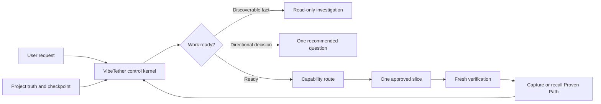
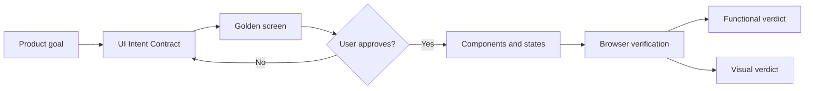

# VibeTether

Direction control for long-running AI coding work.

> Keep coding agents tethered to project truth.

[](https://github.com/t01089572455/vibetether/actions/workflows/ci.yml)
[](LICENSE)
[](#evidence-and-current-limits)

Designed for stronger agents such as Claude Fable 5 and GPT-5.6, VibeTether aims to reduce long-task drift and expensive rework. It keeps project truth, readiness, Skill routing, checkpoints, verification, and reusable success visible across long tasks, Goal mode, compaction, resume, and handoff.

## Why VibeTether exists

Long-running coding agents usually fail in three repeatable ways:

- They start product work before the goal, boundaries, or success evidence are actually clear.
- A capable agent loses the reason for a decision after a long context, Goal-mode slice, compaction, resume, or handoff.
- A build, deployment, local-environment, or publishing workflow finally works, but its decisive conditions are never recorded for the next agent.

VibeTether is a project-local control Skill, advisory Skill router, and reusable-success capture loop. It does not replace an agent's ability to design or implement. It makes the approved goal, project rules, current slice, evidence, and proven operational paths easier to recover before a small mistake becomes a wide rebuild.

It is distilled from recurring public engineering practices: durable specifications, small verifiable slices, explicit decision ownership, primary-source evidence, visual acceptance, structured handoffs, and verification before claims. Community Skills remain specialists; VibeTether remains the project authority and control layer.

## The control loop

In plain English, VibeTether asks: *are we ready, what truth governs this action, which one method best fits, what fresh evidence proves it, and should this reusable success be saved?*



The readiness gate checks whether the goal, scope, protected capabilities, success evidence, applicable project truth, risk, and current slice are sufficient before product work starts. It investigates facts the repository can answer. It asks the user only for product, architecture, visual, destructive-data, permission, security, or release decisions. Local, reversible, goal-aligned technical choices can proceed autonomously.

## Quick start

For a new or existing project, start with the smallest command:

```sh
npx --yes github:t01089572455/vibetether init
```

The outer `npx --yes` authorizes npm to acquire the VibeTether package. It does **not** answer VibeTether's own project questions. VibeTether's own `--yes` is a trailing CLI flag that bypasses its interactive questions for automation; use it only when explicit flags and discovered facts are enough.

In an interactive greenfield folder, the guided flow is deliberately short:

```text
? Who should this project help, and what outcome should they achieve?
  A small-team operator who can reconcile monthly inventory in one guided workspace.

? What fresh evidence would make the first milestone successful?
  A user can import one sample file and verify the reconciled total.

? What is explicitly out of scope or must not be weakened?
  Do not publish, send data externally, or replace existing access controls.

VibeTether preview
  - write .vibetether/intent.md and project control files
  - install the recommended Codex or Claude control surface
  - no provider fetch until the chosen profile needs one

? Apply this plan? (y/N) y
Initialized. Start with the first bounded, verifiable slice.
```

The first two answers make intent ready. A UI-direction question appears only when repository evidence makes it relevant. The final confirmation happens before project writes or provider fetching.

## Guided project bootstrap

Use the same guided discovery later without reinstalling unchanged provider catalogs:

```sh
npx --yes github:t01089572455/vibetether bootstrap --project .
```

`bootstrap --dry-run` shows discovered truth, remaining questions, and planned changes without writing. `bootstrap --yes` refuses to invent required user-owned direction when answers are absent. A non-interactive `init --yes` leaves an unresolved Intent Contract at `DISCOVER` instead of guessing a product goal from the directory name.

After a successful initialization, a minimal project looks like this:

```text
AGENTS.md and/or CLAUDE.md             Bounded VibeTether instruction block
.vibetether/intent.md                  Confirmed goal, evidence, boundaries, and constraints
.vibetether/project.yaml               Project-truth index and control policy
.vibetether/capabilities.yaml          Advisory scenarios, routes, and exit evidence
.vibetether/providers.lock.yaml        Pinned provider provenance when applicable
.vibetether/experience-index.yaml      Metadata-only Proven Path pointers
.vibetether/state/current.yaml         Local resumable checkpoint
```

VibeTether does not create a fake PRD, ADR, runbook, `CONTEXT.md`, or design system merely to make the tree look complete. When a real product decision, architecture decision, or reusable operational path appears, the appropriate workflow writes it to its natural source and routes it through `project.yaml`.

Existing product documents remain authoritative. If VibeTether finds competing truth sources or a modified managed Skill, it stops and shows the conflict rather than overwriting user work.

## How automatic routing works

You can describe a project or problem in ordinary language; you do not need to know any Skill name. VibeTether checks whether the goal and success evidence are sufficient, detects observable signals from the request and repository, and recommends one installed specialist such as `grilling` when it fits.

That recommendation is advisory. The agent may use a better installed alternative or the declared built-in fallback, but must preserve project authority and record the material reason. No provider is downloaded during active work.

At task entry, compaction, resume, handoff, and consequential phase changes, the agent re-reads the project manifest and applicable truth rather than trusting a summary alone. It asks for confirmation on directional or high-risk choices, while local reversible technical choices can proceed. Project instructions improve control and auditability; they are not a security sandbox and cannot guarantee every host invocation.

### What gets installed?

VibeTether does not require community Skills. The `core` profile supplies its control loop, readiness gate, checkpoints, risk gates, capability contracts, and built-in fallbacks without provider networking. A reviewed non-core installation can add optional specialist providers.

VibeTether does not search GitHub by star count, install arbitrary repositories, follow floating revisions, or fetch a provider merely because a task needs one. Every curated source is declared here, pinned to an exact commit, fingerprinted, and checked against license evidence during an explicit non-core `init`.

| Command or profile | Third-party network activity | Project result |
| --- | --- | --- |
| `npx skills add ... --skill vibe-tether` | Fetches the VibeTether package only | Installs the portable entry Skill; it does not initialize project instructions or community providers |
| `init --profile core` | No provider fetch | Installs VibeTether, managed project instructions, a built-in capability board, checkpoint state, and provider-free fallbacks |
| `init --profile standard` | Fetches pinned Matt Pocock, Superpowers, and Karpathy sources | Base inventory: 53 complete upstream Skills cataloged and 21 exposed Skills; repository evidence can also select bundles |
| `init --profile extended` | Standard sources plus pinned Anthropic source | Adds `frontend-design` without replacing the primary product-design workflow |
| `init --bundle web` | Fetches the pinned Vercel catalog | Catalogs all 9 Vercel Skills and exposes only signal-matched Web specialists |
| `init --bundle production` | Fetches the pinned Addy Osmani catalog | Catalogs all 24 Skills and exposes only approved production specialists |

### How agents discover installed Skills

Initialization gives the host four separate discovery surfaces so it knows a specialist exists without loading every downloaded Skill into every prompt.

| Surface | Audience | What it tells them |
| --- | --- | --- |
| `.agents/skills/` and `.claude/skills/` | Codex and Claude Code host discovery | Verified copies of exposed Skills, including each upstream `SKILL.md` trigger and instructions |
| `.vibetether/capabilities.yaml` | VibeTether and the coding agent | Scenarios, `When to use` signals, primary recommendation, overlays, alternatives, availability, fallback, outputs, and exit evidence |
| `.vibetether/providers.lock.yaml` | Installer, `doctor`, maintainers | Exact repository, commit, fingerprints, license evidence, catalog/exposure state, and ownership |
| `.vibetether/providers/catalog/` | Local inventory and deliberate lookup | Complete audited upstream Skill catalogs outside host discovery |

Run the human-readable dashboard at any time:

```sh
npx --yes github:t01089572455/vibetether capabilities --project .
```

Its output includes the automatic readiness gate, an Installed Skill inventory, every capability's `When to use`, expected outputs and exit evidence, catalog-only alternatives, and live availability. A JSON request returns one deterministic route:

```sh
npx --yes github:t01089572455/vibetether capabilities --project . --phase DISCOVER --capability requirements-clarification --signal goal-unclear --agent codex --json
```

### Default `standard` provider map

The base `standard` profile catalogs 53 complete upstream Skills and exposes these 21 carefully selected Skills to each enabled host. `Primary` owns a workflow phase, `domain` adds a non-overlapping specialty, `alternative` fits only selected signals, `policy` overlays a method without owning the route, and `explicit alias` preserves an upstream command while an automatic route covers the behavior.

| Skill | Source | Role and normal route |
| --- | --- | --- |
| `grilling` | `mattpocock/skills` | Primary requirements and document-alignment interview when goal, scope, constraints, or success evidence are unclear |
| `grill-me` | `mattpocock/skills` | Explicit alias; automatic behavior is covered by `grilling` |
| `grill-with-docs` | `mattpocock/skills` | Explicit alias; automatic behavior is covered by `grilling` plus `domain-modeling` |
| `domain-modeling` | `mattpocock/skills` | Domain support for durable terminology, glossary, model, or ADR decisions |
| `codebase-design` | `mattpocock/skills` | Alternative read-only orientation when repository entry points are unclear |
| `prototype` | `mattpocock/skills` | Alternative throwaway experiment when testing is cheaper than debating uncertainty |
| `research` | `mattpocock/skills` | Alternative primary-source research when a current external fact is required |
| `brainstorming` | `obra/superpowers` | Primary product/design workflow after intent is ready for alternatives and trade-offs |
| `dispatching-parallel-agents` | `obra/superpowers` | Domain workflow only when tasks are independent, subagents exist, and delegation is authorized |
| `executing-plans` | `obra/superpowers` | Primary execution of one verified plan slice at a time |
| `finishing-a-development-branch` | `obra/superpowers` | Primary integration and release-choice workflow after implementation is verified |
| `receiving-code-review` | `obra/superpowers` | Review-feedback workflow before changing a reviewed design or implementation |
| `requesting-code-review` | `obra/superpowers` | Independent review before merge, release, or a major capability claim |
| `subagent-driven-development` | `obra/superpowers` | Execution workflow for approved independent slices with review between them |
| `systematic-debugging` | `obra/superpowers` | Primary diagnosis before fixing unexplained behavior |
| `test-driven-development` | `obra/superpowers` | Test-first implementation of an approved behavior change |
| `using-git-worktrees` | `obra/superpowers` | Isolated worktree setup when feature work needs separation |
| `verification-before-completion` | `obra/superpowers` | Evidence check before claiming completion, repair, or passing verification |
| `writing-plans` | `obra/superpowers` | Primary implementation planning after direction is approved |
| `writing-skills` | `obra/superpowers` | Domain workflow for creating or revising an Agent Skill |
| `karpathy-guidelines` | `multica-ai/andrej-karpathy-skills` | Policy overlay for simple, surgical, assumption-aware implementation |

## Proven Path capture and recall

After every verified user-level or engineering-level success, VibeTether runs a Success Capture Gate. A reusable workflow that succeeds for the first time is a `first-proven-path`, even when the first attempt succeeded. It is captured immediately; a recovered or materially changed path updates its durable artifact; an unchanged repeat is marked `already-encoded` rather than duplicated.

The index `.vibetether/experience-index.yaml` stores safe metadata and artifact pointers, not full transcripts, private reasoning, credentials, private keys, one-time codes, or sensitive output. It uses three final checkpoint dispositions: `captured`, `already-encoded`, and `not-reusable`.

On a later task, the resolver returns `applicable_experience`: only matching Proven Path metadata, artifact paths, status, and revalidation needs. The agent then reads the selected artifact before inventing an operational route. It does not inject every runbook body into every task. A provisional or changed-environment path must be freshly revalidated.

Natural sources remain authoritative: tests and validators document deterministic behavior; `docs/operations/` documents build, local environment, deployment, publication, authentication, recovery, and external services; ADRs document architecture; specifications document product direction. `vibetether doctor` checks the index, artifact paths, checkpoint consistency, and that a completion-like state has no pending disposition.

## Long tasks and Goal mode

Goal mode is useful only while the current objective stays connected to its authority and evidence. VibeTether preserves that connection by recording a bounded slice and checkpoint, then requiring a full re-anchor after a compaction, interruption, handoff, repeated correction, or phase change.

A full re-anchor reloads the manifest and applicable truth sources, compares the user request with the checkpoint and repository state, identifies unresolved conflict or evidence gaps, and chooses one next slice. It does not reload every file for a small local action. The intent is a proportional control loop: strong enough to prevent blind propagation, small enough not to turn every edit into ceremony.

For repeatable build, environment, CI, deployment, publication, migration, authentication, external-service, recovery, or release work, the re-anchor also queries `applicable_experience`. A matching verified path is read first; an absent, stale, or inapplicable path is recorded honestly instead of fabricated.

## Evidence and current limits

This is a **0.2.2 preview**. The repository includes deterministic contract, lifecycle, catalog, license, routing, rollback, and scenario-matrix tests plus 14 static drift-pressure scenarios. Those static checks are **not independent agent forward tests** and cannot justify a stable `1.0.0` effectiveness claim.

A three-role comparative adjudication in development scored synthetic next-action responses at **30/30** with VibeTether and **24/30** for an already strong baseline, with **35.0%** more words. The observed difference was explicit re-anchor, checkpoint, authority, and functional-versus-visual acceptance discipline. Read the [evaluation report](evals/results/preview-evaluation.md), [run metadata](evals/results/run-metadata.json), and [honesty boundary](evals/README.md).

These preview checks support rule reading, route selection, safety gates, and success capture. They do not prove zero drift, automatic compliance by every host, or measured Token savings. VibeTether does not make a Token-savings claim; the product goal is fewer direction errors and fewer expensive rebuilds.

Project instructions are a behavioral control layer, not a security sandbox. VibeTether does not add privileged hooks, MCP servers, telemetry, deployment access, or remote execution. It reduces the risk and propagation cost of drift; it cannot guarantee zero drift, perfect success classification, provider quality, correct user decisions, or host-level automatic invocation.

## Fastest setup: install everything

Run this from the project you want VibeTether to control:

```sh
npx --yes github:t01089572455/vibetether init --project . --agent both --profile extended --bundle web --bundle production --yes
```

This maximum reviewed installation adds the control Skill for Codex and Claude Code, then downloads and catalogs every curated source enabled by VibeTether: Matt Pocock, Superpowers, Karpathy, Anthropic, Vercel Web, and Addy Osmani Production. It does not expose every upstream Skill to every agent. It catalogs complete pinned inventories for provenance while exposing only approved compatible specialists, so competing routers and unrelated Skills remain outside host discovery.

Verify it:

```sh
npx --yes github:t01089572455/vibetether doctor --project . --json
npx --yes github:t01089572455/vibetether capabilities --project .
```

## Customize the installation

Use these options when the fastest path is not what you need.

### Provider-free two-stage bootstrap

If provider networking is unavailable, start with the offline control loop and upgrade later:

```sh
npx --yes github:t01089572455/vibetether init --project . --agent both --profile core --no-auto-bundles --yes
npx --yes github:t01089572455/vibetether init --project . --agent both --profile extended --bundle web --bundle production --yes
```

The `core` step installs VibeTether, the managed instruction block, capability board, checkpoint state, and safe fallbacks without cloning a community repository. Re-running `init` with `extended` upgrades the same installation transactionally.

### Install only the portable Skill

Use this when you want VibeTether's control method without changing project instructions or fetching community providers:

```sh
npx skills add t01089572455/vibetether --skill vibe-tether
```

### Preview, inspect, update, or remove

```sh
# Preview before writing
npx --yes github:t01089572455/vibetether init --agent both --profile standard --dry-run

# Smaller standard profile
npx --yes github:t01089572455/vibetether init --agent both --profile standard --yes

# Human dashboard or a deterministic JSON route
npx --yes github:t01089572455/vibetether capabilities --project .
npx --yes github:t01089572455/vibetether capabilities --project . --phase DISCOVER --capability requirements-clarification --signal goal-unclear --agent codex --json

# Safe removal preview and apply
npx --yes github:t01089572455/vibetether uninstall --dry-run
npx --yes github:t01089572455/vibetether uninstall --project . --dry-run
npx --yes github:t01089572455/vibetether uninstall --project . --yes
```

The dry-run is network-free for provider content and writes nothing. Review planned project files, catalogs, exposures, and license operations first. Re-running `init` is also the update and repair path: unchanged installations are idempotent, while modified managed copies stop for review. Uninstall removes only unchanged VibeTether-owned files and managed instruction blocks; it preserves user documents, the Intent Contract, runtime checkpoint, backups, and every Skill that existed before VibeTether.

## Profiles and bundles

| Profile | Catalog and exposure behavior | Network boundary |
| --- | --- | --- |
| `core` | VibeTether plus the full built-in capability board; no community catalog or provider exposure | No provider network access |
| `standard` | Complete Matt Pocock, Superpowers, and Karpathy catalogs; 21 exposed Skills | Fetches pinned sources during explicit `init` |
| `extended` | Standard plus Anthropic `frontend-design` | Fetches the additional pinned Anthropic source |

Optional bundles add complete catalogs and expose only applicable specialists:

| Bundle | Complete catalog | Automatically detected evidence | Exposed specialists |
| --- | --- | --- |
| `web` | 9 Vercel Skills | React, Next.js, React Native, Expo, or `vercel.json` | Matching React, React Native, Web verification, Vercel, and performance specialists |
| `production` | 24 Addy Osmani Skills | GitHub Actions or a recognized migration directory | Matching CI/CD or migration specialists; explicit selection exposes the approved seven |

```sh
npx --yes github:t01089572455/vibetether init --profile standard --bundle web --yes
npx --yes github:t01089572455/vibetether init --profile standard --bundle production --yes
npx --yes github:t01089572455/vibetether init --profile standard --bundle web --bundle production --yes
npx --yes github:t01089572455/vibetether init --profile standard --no-auto-bundles --yes
```

`standard` and `extended` scan repository evidence before installation. An explicit bundle is an install-time decision, not permission to deploy, migrate data, change secrets, or publish. Those actions keep their separate user gates. `core` rejects `--bundle` so its provider path remains offline.

## When should I use what?

The agent-facing version of this table is contract-linked to [`registry/scenarios.json`](registry/scenarios.json) and installed with the Skill.

| Scenario ID | Plain-language situation | Recommended path |
| --- | --- | --- |
| `vague-project` | Goal, scope, or acceptance is unclear | `grilling`, then a user-owned Intent Contract |
| `document-conflict` | Request and durable project sources disagree | Document alignment and authority resolution; stop if unresolved |
| `unfamiliar-codebase` | Repository entry points are unclear | `codebase-design` before planning or editing |
| `huge-effort` | Work spans workstreams or context windows | Built-in milestone/checkpoint wayfinding; catalog-only `wayfinder` stays visible |
| `prototype-choice` | A bounded experiment can answer costly uncertainty | `prototype` with a learning goal and discard boundary |
| `new-behavior` | One approved slice adds behavior | VibeTether execution primary plus `karpathy-guidelines` overlay |
| `bug-diagnosis` | Behavior is unexpected and cause is unknown | `systematic-debugging` before a fix |
| `ui-direction` | Visual direction is not approved | UI Intent Contract and golden screen; `frontend-design` in `extended` |
| `web-implementation` | Approved React, Next.js, React Native, or Vercel work | Highest-priority matching Web specialist |
| `compaction-handoff` | Context was compacted, resumed, or handed off | Full VibeTether re-anchor before action |
| `triage-qa` | Several issues need reproduction and priority | Built-in evidence-first triage; catalog alternatives remain visible |
| `production-migration` | A migration or deprecation is proposed | `deprecation-and-migration` plus destructive-data gate |
| `first-proven-path` | A reusable workflow succeeds for the first verified time | Capture a sanitized durable Proven Path immediately |
| `completion` | The agent is about to claim completion | `verification-before-completion` with fresh evidence |

## Walkthroughs

### A vague new project

For “build me a customer portal,” VibeTether detects missing goal, scope, and acceptance evidence; investigates repository facts; then routes to model-invokable `grilling`. It asks one recommended user-owned decision at a time. Product implementation waits until goal, boundaries, success evidence, and the first slice are explicit.

### An unfamiliar codebase

When the task is clear but entry points are not, the route selects `codebase-design` for a read-only map. `research` can resolve uncertain external facts, and `prototype` can answer a bounded technical question when testing is cheaper than debate.

### UI direction and implementation

`ui-direction` first locks product goal, page type, information hierarchy, interaction states, brand constraints, and one representative golden screen. Visual direction needs user approval before propagation. Only then does `web-implementation` select a React, Next.js, React Native, or Web specialist. Browser behavior and visual similarity are verified separately.



### Bug diagnosis, release, and migration

`bug-diagnosis` routes to `systematic-debugging`: reproduce, isolate, form discriminating hypotheses, identify root cause, and implement the smallest correction with regression evidence. A failing test is evidence, not permission for a broad rewrite.

`production-migration` can recommend the migration specialist, but cannot approve destructive data work. Release preparation can recommend `shipping-and-launch`; publication still needs fresh verification and explicit user confirmation. Provider choice never weakens migration, permission, security, privacy, merge, deploy, release, or publish gates.

## Catalog vs exposure

VibeTether deliberately separates five concepts:

- **Cataloged:** the complete audited Skill directory is stored under `.vibetether/providers/catalog/` for inventory and routing metadata; it is outside host discovery.
- **Exposed:** a verified copy is installed under `.agents/skills/` or `.claude/skills/`, where the selected host can discover it.
- **Automatically eligible:** the upstream Skill permits model invocation and VibeTether has a non-conflicting route for current signals.
- **Alternative or overlay:** the Skill supports a primary workflow without taking phase ownership. Karpathy guidance is a policy overlay, not a competing router.
- **Catalog-only or explicit-only:** the Skill stays searchable but is not silently invoked; VibeTether supplies a safe automatic equivalent when appropriate.

Complete catalogs do not mean “run everything.” Stacking workflow owners increases trigger collisions and context cost. VibeTether therefore does not expose competing router Skills such as `using-superpowers`, `ask-matt`, or `using-agent-skills`.

Upstream aliases are handled honestly. `grill-me` is an explicit alias while its behavior is automatically covered by `grilling`; `grill-with-docs` is covered by `grilling` plus `domain-modeling`. Upstream `wayfinder`, `handoff`, and `triage` remain catalog alternatives when their metadata does not permit implicit invocation.

## Codex and Claude

| Harness | Instruction surface | Entry Skill | Provider exposure |
| --- | --- | --- | --- |
| Codex | `AGENTS.md` managed block | `.agents/skills/vibe-tether/` | `.agents/skills/` |
| Claude Code | `CLAUDE.md` managed block | `.claude/skills/vibe-tether/` | `.claude/skills/` |

| Agent harness | Status | Control surfaces |
| --- | --- | --- |
| Codex | Official preview | Project Skill, `AGENTS.md`, board, offline resolver |
| Claude Code | Official preview | Project Skill, `CLAUDE.md`, board, offline resolver |
| Other Agent Skills hosts | Portable Skill; not release-tested | Host-dependent discovery and routing |

VibeTether edits only its marked instruction block and creates a backup before the first instruction-file change. Existing project instructions remain authoritative. The installed offline resolver needs no network:

```sh
node .agents/skills/vibe-tether/scripts/resolve-route.mjs --project . --phase PLAN --capability planning --signal multi-step-change --agent codex
node .claude/skills/vibe-tether/scripts/resolve-route.mjs --project . --phase VERIFY --capability completion-verification --signal about-to-claim-complete --agent claude
```

Supported commands and flags are shown with:

```sh
npx --yes github:t01089572455/vibetether --help
```

Stable exit codes are `2` for invalid CLI input, `3` for a project conflict, and `4` for a failed health check.

## Upgrade and repair

Run `init` again with the desired profile, harnesses, and bundles. The installer scans repository evidence, resolves the catalog and exposure plan, fetches exact commits only for non-core operations, verifies Skill directories, fingerprints, and license evidence in staging, then applies catalog, exposures, lock, board, licenses, and managed instructions atomically.

Use `--dry-run` before changing profiles or bundles. A profile downgrade keeps inactive ownership records so a later uninstall can still remove unchanged VibeTether-owned copies safely. A changed managed Skill or conflicting managed block remains a stop condition rather than an automatic overwrite.

## Troubleshooting

### Windows Schannel recovery

If a provider download fails with `schannel`, `SEC_E_NO_CREDENTIALS`, or `failed to receive handshake`, run the installation in Command Prompt with Git's documented environment-config channel:

```bat
set "GIT_CONFIG_COUNT=1"
set "GIT_CONFIG_KEY_0=http.sslBackend"
set "GIT_CONFIG_VALUE_0=openssl"
npx --yes github:t01089572455/vibetether init --project . --agent both --profile extended --bundle web --bundle production --yes
```

`GIT_SSL_BACKEND=openssl` does not configure Git's HTTP backend and is ignored. The three `GIT_CONFIG_*` variables are inherited by the provider Git subprocesses and are equivalent to configuring `http.sslBackend=openssl` for that command session.

### PowerShell blocks `npm.ps1`

Use `npm.cmd test`, `npm.cmd run check`, or `npm.cmd version` instead of weakening the machine execution policy. If npm reports `EPERM` while writing a cache under a protected directory, point `npm_config_cache` to a user-writable temporary cache for that command; do not run the release as Administrator merely to write a shared cache.

### `doctor` reports a changed managed Skill

VibeTether will not overwrite or remove the modified copy. Back up the customization, compare it with the pinned upstream version, then restore the managed fingerprint or move the customization to a user-owned Skill name before re-running `init`. Registered legacy fingerprints are not treated as customizations.

### Windows reports `EPERM` while uninstalling a Skill

Claude Code, Codex, an editor, or another process may still have a file open without Windows delete sharing. Close the process using the affected Skill and retry `uninstall --dry-run` before `uninstall --yes`. VibeTether quarantines Skill directories before editing managed instruction blocks, so a lock at this stage leaves those files unchanged. See [Windows Skill lifecycle recovery](docs/operations/windows-skill-lifecycle.md).

### A provider is unavailable during a task

Run `capabilities` so live installation paths are refreshed. Optional providers fall back to the declared built-in path. Do not download a provider in the middle of active work; reconfigure it through a reviewed `init` operation.

### The expected Web or Production specialist was not exposed

Inspect `bundle_signals` in `.vibetether/project.yaml`. Use `--bundle web` or `--bundle production` for an explicit install-time choice. Use `--no-auto-bundles` when repository evidence should not control bundle selection.

### Initialization stops on license evidence

This is intentional. Missing full license text, changed README declarations, unexpected Skill directories, wrong commits, or fingerprint mismatches stop before project writes. Review the pinned source and update registry evidence in a new audited release; do not bypass the check locally.

### Project instructions contain a managed-block conflict

VibeTether edits only exact marked blocks. Preserve user text, repair duplicate or reversed markers manually, and re-run `init --dry-run`; it will not guess which conflicting block should win.

### I only want the control loop

Use `--profile core`. Provider fetching is disabled for that initialization path. The initial `npx` acquisition may still require the package source unless it is already cached.

## Provider provenance and licensing

All provider sources are pinned to exact commits. VibeTether verifies the declared complete inventory and per-Skill fingerprints before copying anything into a project.

| Source | Pinned release or commit | Catalog | License evidence mode |
| --- | --- | ---: | --- |
| `mattpocock/skills` | `v1.1.0` / `d574778f94cf620fcc8ce741584093bc650a61d3` | 38 complete Skills | MIT `full-text` |
| `obra/superpowers` | `v5.1.0` / `f2cbfbefebbfef77321e4c9abc9e949826bea9d7` | 14 complete Skills | MIT `full-text` |
| `multica-ai/andrej-karpathy-skills` | `2c606141936f1eeef17fa3043a72095b4765b9c2` | 1 complete Skill | MIT `readme-declaration` |
| `anthropics/skills` | `9d2f1ae187231d8199c64b5b762e1bdf2244733d` | selected `frontend-design` | Apache-2.0 `full-text` |
| `vercel-labs/agent-skills` | `f8a72b9603728bb92a217a879b7e62e43ad76c81` | 9 complete Skills | MIT `readme-declaration` |
| `addyosmani/agent-skills` | `98967c45a42b88d6b8fb3a88b7ff6273920763d6` | 24 complete Skills | MIT `full-text` |

`full-text` means the pinned source contains a complete license file whose exact hash is verified and whose text can be installed under `.vibetether/licenses/`. `readme-declaration` means the upstream repository declares a license in a pinned README but lacks the expected full root license file at that commit. VibeTether verifies the README hash and declaration, records a warning and provenance, does not fabricate license text, and does not embed provider content in the npm package.

Provider content is fetched only during an explicit non-core `init`, remains governed by its upstream license, and is not relicensed by VibeTether. See [THIRD_PARTY_NOTICES.md](THIRD_PARTY_NOTICES.md).

## Personal acceptance tour

After cloning the repository, run the offline tour:

```sh
npm ci
npm run acceptance:tour
```

The tour creates a temporary project, initializes the `core` profile for Codex, runs `doctor`, prints the capability dashboard, repeats initialization to exercise idempotence, previews uninstall, applies uninstall, and removes the temporary directory. It does not fetch provider repositories.

For a manual provider tour in a disposable project, preview before applying:

```sh
mkdir vibetether-smoke
npx --yes github:t01089572455/vibetether init --project ./vibetether-smoke --agent both --profile standard --bundle web --dry-run
```

Replace `--dry-run` with VibeTether's trailing `--yes`, then run `doctor` and `capabilities`, inspect the board and lock, re-run the same `init`, and finish with `uninstall --dry-run`. Standard and bundle tours fetch pinned upstream repositories.

## Community basis, development, and license

VibeTether is an original control kernel informed by [Superpowers](https://github.com/obra/superpowers), [Matt Pocock's Skills](https://github.com/mattpocock/skills), [GitHub Spec Kit](https://github.com/github/spec-kit), [OpenSpec](https://github.com/Fission-AI/OpenSpec), [BMAD Method](https://github.com/bmad-code-org/BMAD-METHOD), [Anthropic Skills](https://github.com/anthropics/skills), Vercel's agent Skills, Addy Osmani's engineering Skills, and Karpathy-style guidance. Popularity helped discovery, not validation: every cataloged Skill is classified by role, invocation policy, exposure, conflicts, fallback, outputs, and exit evidence. No upstream provider becomes project authority.

Node.js 20 or newer is required for development:

```sh
npm ci
npm test
npm run eval
npm run acceptance:tour
npm run check
npm pack --dry-run
```

Use `npm run audit:provider -- --help` to inspect the deterministic provider-audit interface. Read [CONTRIBUTING.md](CONTRIBUTING.md) before changing routing, catalog, adapter, or lifecycle contracts. Report security issues through [SECURITY.md](SECURITY.md). VibeTether is released under the [MIT License](LICENSE).
