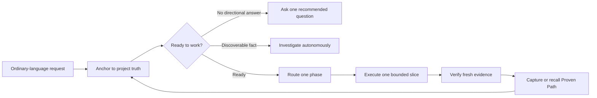

# VibeTether

> Long tasks drift. Skills get forgotten. Proven fixes disappear.

VibeTether keeps coding agents anchored to project truth, routes each phase to
the right Skill, and recalls workflows that already worked.

[](https://github.com/t01089572455/vibetether/actions/workflows/ci.yml)
[](LICENSE)
[](#honest-limits)

## One-command setup

Copy and paste this inside the project you want to control:

```sh
npx --yes --package=https://codeload.github.com/t01089572455/vibetether/tar.gz/refs/heads/main vibetether init --project . --agent both --profile extended --bundle web --bundle production --yes
```

That is the easiest reviewed installation: VibeTether for Codex and Claude Code,
plus its curated product, planning, debugging, testing, UI, Web, and production
specialists. The reliable Codeload form avoids npm's Git/SSH package path.

Prefer prompts over flags? Run the guided setup:

```sh
npx --yes --package=https://codeload.github.com/t01089572455/vibetether/tar.gz/refs/heads/main vibetether init --project .
```

It explains each finite choice, recommends a safe default, and asks you to supply
the project goal and success evidence instead of letting the agent invent them.
See the [installation guide](docs/installation.md) for smaller profiles, previews,
updates, and uninstall.

## Why I built this

I did not build VibeTether because modern coding agents are weak. I built it
because they are strong enough to move very quickly—and long enough tasks make
it easy for that speed to leave the original request behind.

I kept seeing the same failures: a specification existed but stopped governing
the work after compaction; an agent started from guesses because the brief was
vague; a useful Skill existed but a beginner did not know its name; a visual
direction was silently improvised; and a deployment or publishing path finally
worked but was forgotten on the next run.

VibeTether turns those lessons into a small project-local control layer. It is
designed for stronger agents such as Claude Fable 5 and GPT-5.6 to reduce
long-task drift and expensive rework—not to replace their technical judgment.

## See it in 30 seconds

You say: “Build me a customer portal.” You do not need to know any Skill name.

1. Intent is vague, so VibeTether routes discovery to `grilling` and asks one
   recommended product question at a time.
2. Once the goal and acceptance evidence are ready, the agent re-enters the
   router at the phase change and uses `brainstorming` for alternatives and
   trade-offs.
3. After direction is approved, `writing-plans` creates bounded slices.
4. During implementation, `test-driven-development` owns behavior changes.
5. Before a completion claim, `verification-before-completion` demands fresh
   evidence. The route is closed with `vibetether route complete`.

The same re-check happens at task entry, consequential phase changes, compaction,
resume, handoff, repeated failure, the next slice, completion, merge, release,
and publication. That phase re-entry is what keeps a long Goal-mode task from
treating an old summary as current authority.

## What initialization adds

VibeTether gives a new or existing project a beginner-readable control surface:

| Artifact | Purpose |
| --- | --- |
| `AGENTS.md` and/or `CLAUDE.md` | Tells Codex or Claude Code when to re-enter VibeTether |
| `.vibetether/intent.md` | Records the user-owned goal, evidence, boundaries, and constraints |
| `.vibetether/project.yaml` | Indexes the project's governing truth sources |
| `.vibetether/capabilities.yaml` | Shows scenarios, routes, fallbacks, outputs, and exit evidence |
| `.vibetether/state/current.yaml` | Keeps the current phase and bounded slice resumable |
| `.vibetether/experience-index.yaml` | Points to reusable workflows that have actually succeeded |

Existing specifications, ADRs, product docs, and instructions remain
authoritative. VibeTether does not generate fake documents just to fill a tree.

## The control loop



The router is advisory, not a rigid workflow engine. It can choose an installed
alternative when that better fits, but it records why. Low-risk, reversible,
goal-aligned technical work can proceed autonomously. Product direction,
architecture, visual direction, destructive data, permissions, and release scope
still require the appropriate user decision.

## Features

| Capability | What it changes |
| --- | --- |
| Readiness gate | Stops product work from starting on guessed direction |
| Project-truth re-anchor | Re-reads applicable rules before consequential actions |
| Automatic Skill routing | Maps observable task signals to one suitable installed Skill or fallback |
| Stateful phase handshake | Records route selection, required output, evidence, completion, or abandonment |
| Long-task checkpoints | Carries the current objective and slice through compaction, resume, and handoff |
| Proven Path recall | Reads a matching successful runbook before rediscovering an operational workflow |
| First-success capture | Records a reusable workflow the first verified time it works |
| Curated providers | Pins exact commits, fingerprints content, and keeps competing routers out of host discovery |
| Safe Windows upgrades | Defers locked active-Skill replacement and resumes it on the next run |
| Project-local extension | Lets a project add its own primary, alternative, or overlay routes |

## Automatic routes are inspectable

See the capability board:

```sh
vibetether capabilities --project .
```

Start and close one phase route explicitly:

```sh
vibetether route --project . --phase PLAN --capability planning --signal multi-step-change --agent codex
vibetether route complete --project . --evidence "The approved plan names bounded slices and verification."
```

If the route no longer fits:

```sh
vibetether route abandon --project . --reason "The governing product decision changed."
```

The installed `AGENTS.md`/`CLAUDE.md` block tells the host agent to perform this
handshake at long-task boundaries. A record proves that a route was selected and
disposed; it does not expose private reasoning or pretend to prove semantic
correctness. Read the [routing guide](docs/routing.md) for the complete model.

## Add your own Skills

Install a project Skill under `.agents/skills/` or `.claude/skills/`, then run:

```sh
vibetether customize --project .
```

The guided editor writes `.vibetether/routes.local.yaml`. A local route can be a
signal-specific `primary`, an `alternative`, or an additive `overlay`. It extends
the reviewed board; it cannot weaken authority, readiness, evidence, security,
permission, destructive-data, or release gates. If a local primary is missing,
VibeTether names the problem and falls back to the curated route.

## Proven workflows do not disappear

After every verified engineering- or user-level success, the Success Capture
Gate decides whether the result is `captured`, `already-encoded`, or
`not-reusable`. A reusable workflow that works for the first time is a
`first-proven-path` even when it never failed first.

Later, `applicable_experience` returns only matching metadata and safe artifact
paths. The agent reads the selected runbook before improvising the same build,
environment, deployment, publishing, migration, authentication, or recovery
path again. Credentials, private keys, one-time codes, private reasoning, and
sensitive tool output are never captured. See [Proven Paths](docs/proven-paths.md).

## Profiles and providers

- `core`: the provider-free control loop and built-in fallbacks.
- `standard`: complete pinned Matt Pocock, Superpowers, and Karpathy catalogs,
  with only compatible specialists exposed.
- `extended`: `standard` plus Anthropic's `frontend-design`.
- `--bundle web`: signal-matched Vercel Web specialists.
- `--bundle production`: approved CI/CD, migration, security, observability,
  performance, and release specialists.

No provider is downloaded during active work. VibeTether does not search GitHub
by star count or install arbitrary repositories; sources are reviewed, pinned,
fingerprinted, and license-checked during explicit initialization. Complete
inventories and exposure rules live in [Providers and Skills](docs/providers.md).

## Codex and Claude Code

| Host | Project instruction | Entry Skill | Specialist exposure |
| --- | --- | --- | --- |
| Codex | `AGENTS.md` | `.agents/skills/vibe-tether/` | `.agents/skills/` |
| Claude Code | `CLAUDE.md` | `.claude/skills/vibe-tether/` | `.claude/skills/` |

Both are official preview targets. Other Agent Skills hosts can use the portable
Skill, but project instruction discovery and phase re-entry are host-dependent.

## Verify the installation

```sh
vibetether doctor --project . --json
vibetether capabilities --project .
```

For repository contributors, the offline acceptance tour is:

```sh
npm ci
npm run acceptance:tour
```

## Honest limits

VibeTether is a behavioral control layer, not a security sandbox or a guaranteed
workflow engine. Its automatic behavior requires the host agent to cooperate
with project instructions. It cannot guarantee zero drift, correct user choices,
perfect Skill quality, or successful external services.

Reducing drift and expensive rework is the design goal. VibeTether makes no
measured Token-savings claim. Its deterministic tests verify routing contracts,
phase handshakes, recovery, capture rules, and static drift-pressure scenarios;
they are not proof that every model will obey every instruction.

## Documentation

- [Installation and updates](docs/installation.md)
- [Routing, phase re-entry, and project extensions](docs/routing.md)
- [Proven Path capture and recall](docs/proven-paths.md)
- [Providers, catalogs, exposure, and licenses](docs/providers.md)
- [Troubleshooting](docs/troubleshooting.md)
- [Windows Skill lifecycle recovery](docs/operations/windows-skill-lifecycle.md)
- [Third-party notices](THIRD_PARTY_NOTICES.md)
- [Contributing](CONTRIBUTING.md)

## Community basis

VibeTether is an original control kernel informed by recurring practices in
[Superpowers](https://github.com/obra/superpowers),
[Matt Pocock's Skills](https://github.com/mattpocock/skills),
[GitHub Spec Kit](https://github.com/github/spec-kit),
[OpenSpec](https://github.com/Fission-AI/OpenSpec),
[BMAD Method](https://github.com/bmad-code-org/BMAD-METHOD),
[Anthropic Skills](https://github.com/anthropics/skills), Vercel's agent Skills,
Addy Osmani's engineering Skills, and Karpathy-style coding guidance.
Popularity helped discovery; tests, compatibility, license evidence, and role
boundaries decide what VibeTether exposes.

Node.js 20 or newer is required. VibeTether is released under the [MIT License](LICENSE).
