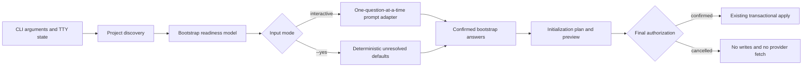

# Guided Bootstrap and Experience Recall Design

Status: Approved
Date: 2026-07-14
Target: VibeTether CLI, project control Skill, generated project surfaces, and public README

## 1. Problem

VibeTether already supplies project-local readiness checks, advisory Skill routing, checkpoints, provider provenance, and first-success capture. Three product gaps remain:

1. The public README explains implementation details before it makes the beginner-facing value obvious.
2. `vibetether init` advertises an interactive prompt but currently refuses all writes without `--yes`; a new or empty directory receives no guided project-truth setup.
3. Reusable success is captured into its natural durable source, but the next agent has no deterministic, low-cost interface for finding applicable Proven Paths before it invents another operational route.

These gaps are especially costly in long tasks and Goal-mode work. A capable agent may start from an underspecified request, lose direction after compaction or handoff, or repeat environment and release discovery because the successful path is not recalled at the next relevant boundary.

## 2. Product Goal

Make VibeTether the beginner-friendly control entry for long-running Codex and Claude coding work:

- the user can start in a new directory with one command;
- VibeTether asks only unresolved directional questions, one at a time, with a recommended answer;
- project rules and confirmed intent become durable before product implementation;
- the agent can recommend the appropriate installed Skill without requiring the user to know Skill names;
- first, recovered, and materially changed reusable paths remain in their natural durable sources;
- later similar tasks discover and read applicable Proven Paths before consequential action.

Success means the simplest new-project path is guided, existing projects remain protected, non-interactive automation remains available, relevant experience is recalled through a deterministic interface, and the README explains the entire loop before advanced installation details.

## 3. Community Basis and Original Boundary

The design adopts recurring practices from current primary sources without presenting popularity as proof of correctness.

From [Matt Pocock's Skills](https://github.com/mattpocock/skills):

- scan the repository before asking questions;
- ask one recommended question at a time;
- skip questions already answered by evidence;
- preview the proposed writes;
- preserve existing instruction files through a bounded section;
- write a small project configuration substrate that later Skills can read.

Matt's setup remains an explicitly invoked, prompt-driven Skill. VibeTether's original contribution is to make readiness and project bootstrap part of the automatic entry loop so beginners do not need to know a setup or router command.

From [Karpathy-inspired guidelines](https://github.com/multica-ai/andrej-karpathy-skills):

- surface assumptions;
- prefer the simplest sufficient implementation;
- keep changes surgical;
- define verifiable success criteria.

`karpathy-guidelines` remains an implementation policy overlay. It does not become a phase owner, router, checkpoint system, or experience store. VibeTether continues to warn that the reviewed upstream commit declares MIT in README metadata but does not contain a complete root license file.

## 4. Scope

### In scope

- a real interactive `init` flow for an interactive terminal;
- automatic greenfield detection and guided bootstrap from the simplest `init` command;
- an explicit `bootstrap` command that reuses the same bootstrap engine;
- deterministic `--yes` behavior for CI and automation;
- confirmed intent written into `.vibetether/intent.md`;
- a metadata-only `.vibetether/experience-index.yaml`;
- applicable-experience results in the route resolver and capability dashboard;
- generated instruction rules requiring experience recall before applicable consequential actions;
- `doctor` validation for the experience index and its relationship to captured artifacts;
- README restructuring around beginner value, long-task control, standardized development, and reusable experience;
- deterministic tests and focused behavioral evaluations for the new contracts.

### Out of scope

- a graphical installer;
- telemetry or a hosted service;
- runtime installation of arbitrary Skills;
- automatic product, architecture, data, security, visual, or release decisions;
- bulk creation of speculative PRDs, ADRs, domain glossaries, or runbooks;
- copying upstream Skill bodies into the VibeTether control kernel;
- automatic commits, pushes, releases, deployments, or external writes;
- a second knowledge base containing copies of runbook, ADR, specification, or test content.

## 5. User Experience

### 5.1 Simplest new-project path

The README leads with one command:

```sh
npx --yes github:t01089572455/vibetether init
```

The outer `npx --yes` authorizes npm package acquisition. It does not answer VibeTether's own project questions.

When stdin and stdout are interactive, `vibetether init` without the VibeTether `--yes` flag:

1. scans the directory, Git remote, instruction files, project documents, package evidence, and existing VibeTether state;
2. reports what is already known and what remains unresolved;
3. recommends harnesses and a profile from evidence while allowing the user to change them;
4. in a greenfield directory, asks the minimum directional question set;
5. previews the planned files and provider activity;
6. requests final confirmation before any write or provider fetch;
7. applies the existing transactional initialization path.

The npm command may also be written as `npx github:t01089572455/vibetether init`; documentation must distinguish npm's confirmation flag from VibeTether's `--yes` flag whenever both appear in one command.

### 5.2 Minimum directional questions

The greenfield flow asks, one question per prompt:

1. Who should this project help, and what outcome should they achieve?
2. What fresh evidence would make the first milestone successful?
3. What is explicitly out of scope or must not be weakened?
4. If repository evidence shows a user-visible interface, what existing brand, reference, or visual direction governs it?

The first two questions require an answer before the guided bootstrap can mark intent ready. Scope constraints may use the safe default of preserving existing instructions and confirming destructive or release actions. The visual question is omitted when it is not applicable.

Technical choices that are local, reversible, and inside the approved direction are not asked in this wizard. Architecture, public contracts, permissions, security, destructive data changes, and release scope remain later confirmation gates when they become concrete.

### 5.3 Existing projects

Existing product documents remain authoritative. The bootstrap engine:

- auto-maps only high-confidence, unambiguous sources;
- asks about competing product or UI direction candidates instead of choosing one;
- never overwrites user-authored truth;
- shows the managed-block diff and new files before writing;
- preserves the current idempotent update and repair behavior;
- treats a changed managed Skill or conflicting managed block as a stop condition.

### 5.4 Non-interactive automation

`vibetether init --yes` remains completely non-interactive. It uses explicit flags and discovered evidence, creates a safe unresolved Intent Contract when direction was not supplied, and leaves the readiness state at `DISCOVER`. It must never infer a confirmed product goal from a directory name or package metadata.

When no TTY is available and `--yes` is absent, the CLI exits with a precise message explaining how to use `--dry-run` or `--yes`; it never hangs waiting for input.

### 5.5 Explicit bootstrap

`vibetether bootstrap --project PATH` runs the same discovery and directional-question engine without reinstalling unchanged provider catalogs. It supports:

- completing a non-interactive initialization later;
- repairing an unresolved Intent Contract;
- reviewing newly discovered truth sources;
- changing confirmed intent only after showing the prior and proposed values.

`bootstrap --dry-run` reports questions, inferred defaults, and planned truth-source changes without writing. `bootstrap --yes` is rejected when required directional answers are absent because automation must not fabricate user-owned direction.

## 6. Generated Project Truth

The smallest trustworthy greenfield output is:

```text
AGENTS.md and/or CLAUDE.md             Bounded VibeTether instruction block
.vibetether/intent.md                  Confirmed goal, evidence, boundaries, constraints
.vibetether/project.yaml               Index of project truth and control policy
.vibetether/capabilities.yaml          Advisory scenarios, routes, and exit evidence
.vibetether/providers.lock.yaml        Pinned provider provenance when applicable
.vibetether/experience-index.yaml      Metadata-only Proven Path pointers
.vibetether/state/current.yaml         Local resumable checkpoint
```

VibeTether does not create a fake `CONTEXT.md`, ADR, PRD, design system, or runbook merely to make the tree look complete. When real domain terms, architecture decisions, product requirements, visual direction, or operational paths emerge, the applicable workflow writes them to their natural destination and routes them through `project.yaml`.

## 7. Guided Bootstrap Architecture

The CLI separates prompting from deterministic planning and transactional application:



The units are:

- `project-scan`: discovers facts and conflicts; it never prompts or writes;
- `bootstrap-model`: converts discovery, CLI flags, and optional answers into known facts, unresolved user decisions, defaults, and the minimum question sequence;
- `prompt-adapter`: owns terminal input/output and can be replaced with a deterministic test adapter;
- `bootstrap-documents`: renders the confirmed Intent Contract and any manifest additions;
- `init`: builds the complete file/provider plan and applies it transactionally;
- `cli`: selects interactive, dry-run, or non-interactive behavior.

Cancellation before final authorization performs no project write and no provider fetch. Failure during provider staging or project application uses the existing rollback and quarantine behavior.

## 8. Experience Recall

### 8.1 Natural sources remain authoritative

Success Capture continues to route knowledge to the correct destination:

- tests, scripts, validators, or CI for deterministic behavior;
- `docs/operations/` for build, environment, deployment, publication, authentication, recovery, and external services;
- ADRs for architecture;
- product specifications or the Intent Contract for product decisions;
- project instructions for repeated local agent conventions;
- Skill references and evaluations for cross-project agent methods.

The experience index never copies those documents. It is a routing index comparable to the capability board.

### 8.2 Index schema

`.vibetether/experience-index.yaml` uses this versioned shape:

```yaml
schema_version: 1
entries:
  - id: github-publication
    use_when:
      - github
      - publish
      - push
      - release
    systems:
      - git
      - github
      - windows
    artifacts:
      - docs/operations/github-publishing.md
    verified_at: 2026-07-13
    revalidate_when:
      - authentication-method-changes
      - remote-changes
    status: proven
```

Required entry fields are `id`, `use_when`, `artifacts`, `verified_at`, `revalidate_when`, and `status`. `systems` is optional. Valid statuses are:

- `proven`: verified and eligible for applicable recall;
- `provisional`: visible as a candidate but requires fresh verification before reliance;
- `obsolete`: retained only to prevent accidental reuse and excluded from normal recall.

The index stores no command transcript, secret value, credential path, private key, token, one-time code, private reasoning, or sensitive output.

### 8.3 Deterministic matching

The route resolver accepts the existing phase, capability, signal, and harness inputs. It additionally reads the experience index and returns `applicable_experience`.

An entry is applicable when:

1. its status is `proven` or `provisional`;
2. at least one normalized task signal matches `use_when` or `systems` exactly;
3. every artifact exists inside the project;
4. no declared revalidation signal is currently active without fresh verification.

Results are ordered by exact signal-match count, then `verified_at` descending, then `id`. The resolver returns metadata and paths only. It does not load artifact bodies into every task.

A `provisional` entry or an active revalidation condition is labeled `requires_revalidation`. It can guide investigation but cannot be treated as a known-good route without fresh evidence. Unrelated entries are omitted.

### 8.4 Agent control rule

Generated `AGENTS.md` and `CLAUDE.md` blocks require the agent to:

1. query applicable experience at task entry, phase changes, resume, and before repeatable build, environment, CI, deployment, publication, migration, authentication, external-service, recovery, or release actions;
2. read the returned artifacts before inventing a new operational path;
3. record the selected experience paths or the material reason a candidate was stale or inapplicable;
4. revalidate provisional or changed-environment paths;
5. run Success Capture after verified success and update both the natural artifact and metadata index when required.

Provider recommendations remain advisory. Experience recall is also advisory about method, but ignoring a matching proven path without a recorded applicability reason is a drift signal.

### 8.5 Capture and doctor integration

For `captured`:

- every checkpoint artifact must exist;
- reusable captured artifacts must have an experience-index entry unless the artifact is itself the VibeTether cross-project method being evaluated;
- the index entry must point back to every captured artifact and include a verified date and revalidation boundary.

For `already-encoded`:

- at least one existing artifact must remain routed;
- an applicable index entry must already exist for a reusable operational path.

For `not-reusable`:

- no index entry is required and no empty record is created.

`doctor` validates schema version, unique IDs, allowed statuses, non-empty normalized signals, date format, project-contained artifact paths, artifact existence, checkpoint/index consistency, and the absence of obvious secret-bearing fields. It cannot prove the semantic correctness of model-authored metadata and must not claim that it can.

## 9. Capability Routing Changes

Two built-in capabilities become explicit on the generated board:

### `project-bootstrap`

- phases: `DISCOVER`, `ALIGN`;
- signals: `greenfield-directory`, `truth-sources-missing`, `intent-unresolved`;
- primary recommendation: installed `grilling` when directional answers are missing;
- optional domain support: `domain-modeling` only when real terminology or durable domain decisions emerge;
- exit evidence: confirmed Intent Contract, routed project truth, and a checkpoint that remains at `DISCOVER` when required answers are absent.

### `proven-path-recall`

- phases: `ALIGN`, `PLAN`, `EXECUTE_ONE`, `VERIFY`, `SHIP`;
- signals include build, local environment, CI, deployment, publication, migration, authentication, external service, recovery, and release;
- provider: VibeTether built-in resolver; no community provider is required;
- output: applicable experience metadata, artifacts read, revalidation needs, and selection reason;
- exit evidence: a matching path was read or a material no-match/stale reason was recorded before consequential action.

## 10. README Information Architecture

The README is reorganized in this order:

1. one-sentence beginner promise;
2. three failure modes: premature implementation, long-context drift, and uncaptured first success;
3. the VibeTether loop: readiness, route, re-anchor, one slice, verify, capture, recall;
4. one fastest installation command;
5. a short guided-bootstrap transcript and generated-file tree;
6. natural-language routing examples showing that the user need not know Skill names;
7. long-task and Goal-mode recovery;
8. standardized development and experience capture/recall;
9. community basis and original contribution boundary;
10. evidence, current preview limitations, and host-control honesty;
11. profiles, bundles, provider discovery, complete commands, upgrades, uninstall, provenance, and troubleshooting.

Public claims use language such as "distilled from recurring public engineering practices". The README must not claim to summarize every post, guarantee zero drift, guarantee automatic invocation by every host model, or treat Star count as validation.

## 11. Error Handling and Safety

- Missing TTY without `--yes`: exit before writes with actionable guidance.
- User cancellation: exit successfully or with a documented cancellation code, with no writes and no provider fetch.
- Competing truth sources: show candidates and require a user decision.
- Existing managed-block conflict or modified managed Skill: stop without partial writes.
- Provider staging failure: preserve the prior installation and roll back the planned transaction.
- Invalid experience index: `doctor` reports exact entries and the resolver excludes unsafe entries.
- Artifact escape or missing artifact: fail validation; never follow a path outside the project.
- Revalidation condition: return the path as requiring revalidation, not proven truth.
- Sensitive value detected in index metadata: fail validation and require redaction.

## 12. Compatibility and Migration

- Existing `init --yes`, `--dry-run`, profiles, bundles, provider pins, ownership fingerprints, and uninstall behavior remain supported.
- Existing projects without an experience index receive an empty versioned index during the next successful initialization.
- Existing `project.yaml` files are preserved and upgraded by adding only unambiguous new routing fields.
- Existing captured Markdown artifacts remain valid; `doctor` gives an actionable upgrade issue when they need index metadata rather than silently rewriting them.
- Uninstall removes an unchanged VibeTether-owned empty index, but preserves user-authored Proven Path artifacts and modified indexes for review.
- No bootstrap or migration commits project files automatically.

## 13. Verification Contract

Implementation is accepted only with fresh evidence for all applicable cases.

### CLI and bootstrap

- empty-directory interactive initialization;
- one-question-at-a-time sequence and recommended defaults;
- empty-directory `--yes` initialization remains non-interactive and unresolved rather than guessed;
- no-TTY behavior does not hang;
- cancellation before confirmation leaves the directory byte-for-byte unchanged;
- existing `AGENTS.md`, only `CLAUDE.md`, both files, and neither file;
- existing project truth and competing source candidates;
- preview before write;
- second-run idempotence;
- provider failure rollback;
- explicit `bootstrap`, `bootstrap --dry-run`, and invalid `bootstrap --yes` behavior.

### Experience recall

- exact signal matching returns the relevant path;
- unrelated experience is not returned;
- multiple matches have deterministic ordering;
- provisional and revalidation-triggered entries are labeled correctly;
- obsolete, missing, escaping, malformed, and secret-bearing entries are rejected or excluded;
- captured operational experience without index metadata fails the completion audit;
- unchanged repeated experience does not create a duplicate entry;
- route output remains metadata-only until the agent reads the selected artifact.

### README and public release

- the first installation path is the simplest supported path;
- npm `--yes` and VibeTether `--yes` are not conflated;
- README commands match CLI help and tests;
- community attributions link to primary repositories;
- Karpathy remains described as a policy overlay with the license-evidence warning;
- preview evidence states sample size and limitations;
- package, README, provider catalogs, and public tests agree.

### Regression

- full unit and integration suite;
- static routing evaluations;
- manual provider-free acceptance tour;
- Windows lifecycle tests;
- package dry-run;
- focused forward trials showing that a new-project request enters clarification and a known operational task reads applicable experience before action.

## 14. Acceptance Boundaries

This design does not claim that project instructions are a security sandbox or that every host model will obey every advisory route. It improves visibility, default behavior, recovery, and auditability through redundant project instructions, explicit capabilities, deterministic metadata, checkpoints, tests, and doctor checks.

The release remains preview until independent, multi-session Codex and Claude trials show acceptable routing accuracy, false-positive experience recall, latency, context cost, and long-task drift reduction.

Token savings are not a product claim or an evaluation target. Public positioning may say that VibeTether is designed for stronger agents such as Claude Fable 5 and GPT-5.6 and aims to reduce long-task drift and expensive rework, but it must not claim measured net Token savings.
